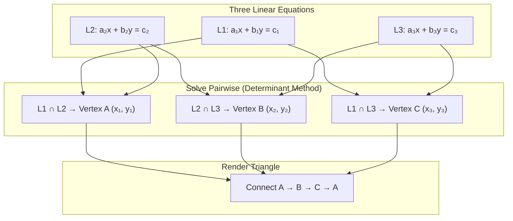
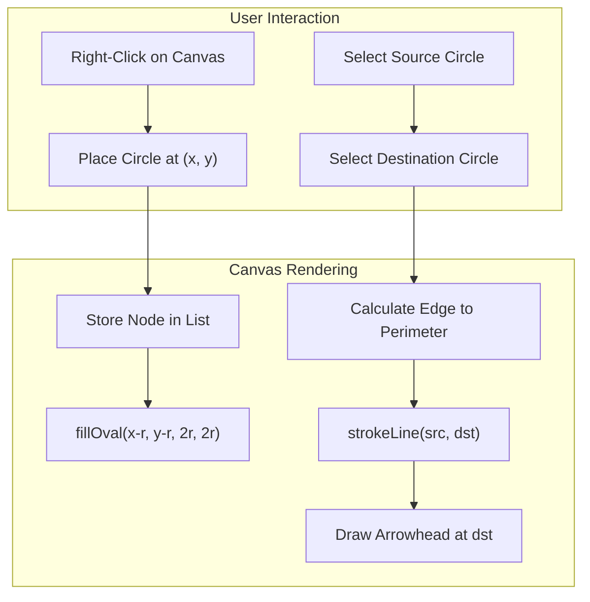

# 📝 Class Notes

### Topic 1: Drawing a Triangle from Three Linear Equations & the Determinant
A triangle can be constructed geometrically by finding the three intersection points of three linear equations of the form `ax + by = c`. Each pair of equations forms a system of two linear equations in two unknowns, and solving the system yields one vertex of the triangle. For equations `a₁x + b₁y = c₁` and `a₂x + b₂y = c₂`, the solution is obtained using the **determinant** of the coefficient matrix: `D = a₁b₂ − a₂b₁`. If `D ≠ 0`, the lines intersect at a unique point given by `x = (c₁b₂ − c₂b₁) / D` and `y = (a₁c₂ − a₂c₁) / D`. If `D = 0`, the lines are either parallel or coincident, and no intersection vertex exists.

The determinant is a scalar value computed from a square matrix that indicates whether the system has a unique solution. For a 2×2 matrix `[[a, b], [c, d]]`, the determinant is `ad − bc`. In the context of triangle construction, three pairs of equations produce three determinant evaluations, each yielding one vertex. Once all three vertices `(x₁, y₁)`, `(x₂, y₂)`, and `(x₃, y₃)` are computed, the triangle can be rendered by connecting these points with line segments using Java's graphics APIs such as `Graphics2D.drawLine()` or `Path2D.Double`.

### Topic 2: JavaFX Project — Circle Drawing with Arrow Connections on Canvas
The main course project requires building a JavaFX application where the user can **right-click** on a `Canvas` to place circles and then **connect** them with directional arrows. This involves handling `MouseEvent` with `MouseButton.SECONDARY` detection to capture the click coordinates and render a filled circle at that position using `GraphicsContext.fillOval()`. Each placed circle is stored as a node object (with center coordinates and radius) in a data structure such as an `ArrayList` or `ObservableList`.

To connect two circles with an arrow, the user selects a source circle and a destination circle (e.g., via click selection or drag). The application then draws a line between the two circle centers using `GraphicsContext.strokeLine()`, and renders an arrowhead at the destination end by computing the angle of the line segment and drawing two short lines at ±30° from the endpoint. The arrow must terminate at the circle's perimeter (not center) to look clean, which requires computing the intersection point along the line at a distance equal to the circle's radius from the center.

### Topic 3: Binary Tree Project Discussion
The binary tree project extends the canvas-based circle/arrow application into a structured data representation. A binary tree is a hierarchical data structure where each node has at most two children: a **left child** and a **right child**. In the context of the JavaFX canvas project, each circle placed on screen represents a tree node, and the directional arrows represent parent-to-child edges. Building a binary tree visually requires enforcing the constraint that each node can connect to at most two child nodes, and the layout should follow a top-down hierarchy with appropriate horizontal spacing to prevent node overlap.

The project discussion covered how to implement binary tree operations (insertion, traversal, deletion) visually, where each operation triggers a re-render of the canvas. For example, an **in-order traversal** visits Left → Root → Right, and the visited nodes could be highlighted sequentially with color changes or animation. This project bridges the gap between abstract data structure theory and interactive graphical visualization, reinforcing understanding of both recursion-based tree algorithms and event-driven JavaFX rendering.

# 💡 Class Reflection — 01/09/26
- **Topics Covered**: Triangle from 3 equations with determinants, JavaFX circle & arrow canvas project, Binary tree project.
- **Reflections**:
  - The determinant method provides an elegant algebraic approach to computing triangle vertices from line intersections; `D = 0` signals degenerate (parallel) cases.
  - The JavaFX canvas project combines mouse event handling, geometric rendering, and data structure design into a cohesive interactive application.
  - Extending the circle-arrow canvas into a binary tree visualizer connects data structure theory with real-time graphical feedback, making tree operations tangible.
