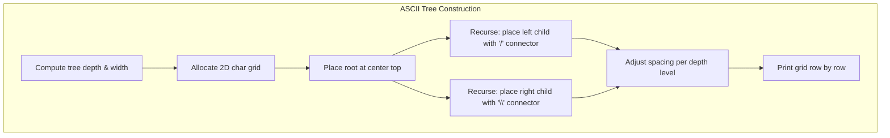
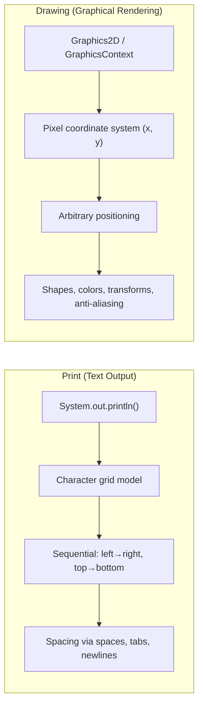
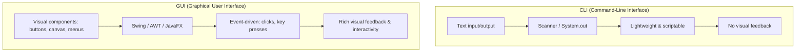
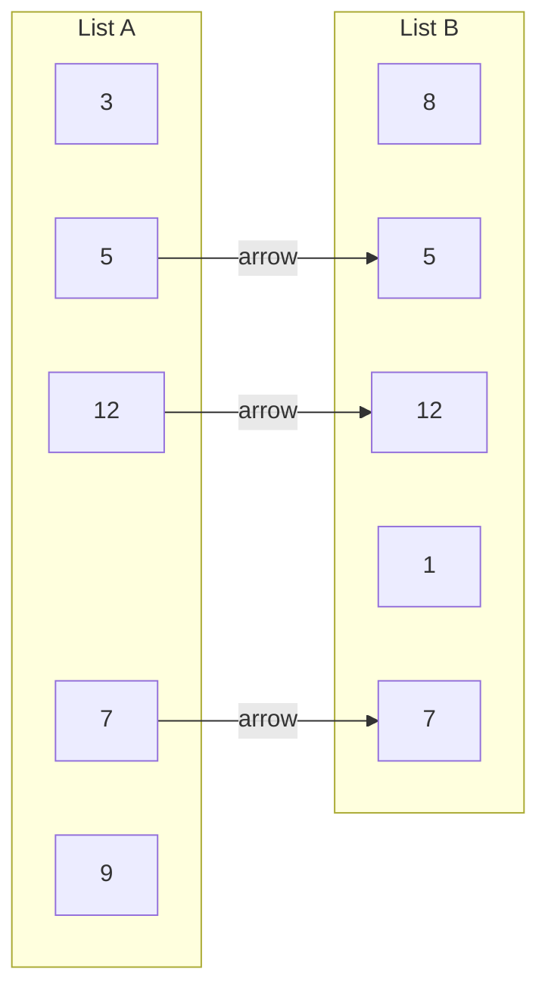
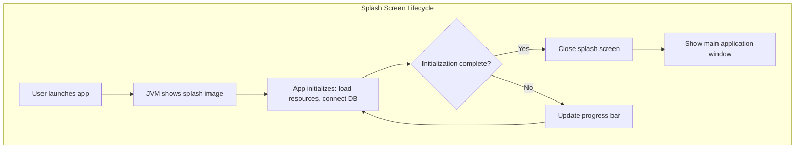

# 📝 Class Notes

### Topic 1: ASCII Tree Drawing Using Keyboard Characters
An ASCII tree is a textual representation of a tree data structure rendered entirely with keyboard characters such as pipes (`|`), hyphens (`-`), backslashes (`\`), forward slashes (`/`), plus signs (`+`), and underscores (`_`). Instead of relying on graphical rendering with pixels and shapes, ASCII trees "draw" hierarchical structures directly in a text console or terminal. For example, a simple binary tree might be visualized as a root value centered on the top line, with `/` and `\` characters diverging downward to child values on subsequent lines. The spacing and alignment of characters is critical — each level of the tree doubles the horizontal offset to maintain a balanced visual appearance.

Building an ASCII tree programmatically in Java involves computing the width requirements at each depth level, then filling a 2D character array (or `StringBuilder` grid) with the appropriate characters at calculated row and column positions. The root node occupies the center of the top row; left children are placed to the left with `/` connectors, and right children to the right with `\` connectors. Common keyboard characters used include `─` (horizontal line), `│` (vertical line), `├`, `└`, `┬`, and `┐` (box-drawing characters), though pure ASCII alternatives like `|`, `-`, `+`, and `\` are used when box-drawing support is unavailable.

```
        10
       /  \
      5    15
     / \   / \
    3   7 12  20
```



### Topic 2: Print vs Drawing — Text Output vs Graphical Rendering
**Printing** refers to outputting text characters sequentially to a stream — typically `System.out.println()` in Java, which writes characters to the standard output (console/terminal). Print operates in a **character grid** model: output flows left-to-right, top-to-bottom, one character at a time. You cannot position text at arbitrary pixel coordinates; you can only control spacing with spaces, tabs, and newlines. This makes print ideal for logs, debug output, tabular data, and ASCII art, but fundamentally limited for freeform visual layouts.

**Drawing**, on the other hand, uses a **pixel-based coordinate system** where you can place shapes, lines, and text at any `(x, y)` position on a canvas or screen. In Java, drawing is performed via `Graphics2D` (Swing/AWT) or `GraphicsContext` (JavaFX), which provide methods like `drawLine(x1, y1, x2, y2)`, `fillOval(x, y, w, h)`, and `drawString(text, x, y)`. Drawing supports anti-aliasing, color gradients, transformations (rotation, scaling), and layered rendering — none of which are possible with print. The key conceptual difference is that print works with **characters on lines**, while drawing works with **pixels on a canvas**.



### Topic 3: CLI vs GUI — Command-Line Interface vs Graphical User Interface
A **CLI (Command-Line Interface)** is a text-based interface where the user interacts with the program by typing commands and reading text output. Java CLI programs use `System.in` (via `Scanner` or `BufferedReader`) for input and `System.out` for output. CLIs are lightweight, scriptable, easily automated, and ideal for server environments, developer tools, and batch processing. However, they require the user to memorize commands and offer no visual feedback like buttons or mouse interaction.

A **GUI (Graphical User Interface)** provides visual elements — windows, buttons, text fields, menus, canvas areas — that users interact with via mouse clicks, keyboard shortcuts, and touch. In Java, GUIs are built using frameworks like **Swing** (older, `JFrame`/`JPanel` based), **AWT** (original, heavyweight components), or **JavaFX** (modern, scene-graph based with FXML support). GUIs support event-driven programming where user actions (clicks, key presses) trigger callback methods (`EventHandler`, `ActionListener`). GUIs are essential for interactive applications, visual editors, and any program where discoverability and visual feedback matter.



### Topic 4: Java Program — Drawing Arrows Between Common Elements of Two Lists
A practical Java exercise involves taking two lists (arrays or `ArrayList`s), finding their **common elements** (intersection), and visually connecting the matching elements with arrows in a graphical output. The algorithm first iterates through both lists to identify shared values — this can be done with nested loops (`O(n×m)`), or more efficiently using a `HashSet` (`O(n+m)`). Once common elements are identified, their positions in each list are recorded.

For the graphical rendering, the two lists are drawn as vertical columns on a JavaFX `Canvas` or Swing `JPanel`, with each element displayed inside a box or circle. For each common element, an arrow (line with arrowhead) is drawn from its position in the left list to its position in the right list. The arrowhead is computed by calculating the angle of the connecting line and drawing two short segments at ±30° from the endpoint. This exercise combines data structure operations (set intersection) with graphical coordinate math and rendering.



```java
// Pseudocode for finding common elements and drawing arrows
List<Integer> listA = Arrays.asList(3, 7, 12, 5, 9);
List<Integer> listB = Arrays.asList(8, 5, 12, 1, 7);
Set<Integer> setA = new HashSet<>(listA);

for (int i = 0; i < listB.size(); i++) {
    if (setA.contains(listB.get(i))) {
        int indexA = listA.indexOf(listB.get(i));
        // Draw arrow from listA[indexA] position to listB[i] position
        drawArrow(gc, leftX, yOffset + indexA * spacing,
                      rightX, yOffset + i * spacing);
    }
}
```

### Topic 5: Splash Screen — Definition and Use Cases
A **splash screen** is a graphical window or image that appears briefly when an application starts up, before the main UI is fully loaded. It typically displays the application's logo, name, version number, and sometimes a loading progress bar. In Java, splash screens can be implemented natively using `java.awt.SplashScreen` (launched via the `-splash:image.png` JVM argument) or programmatically by creating an undecorated `JWindow` or `Stage` that displays an image and then closes after a set delay or when initialization completes.

Splash screens serve several important purposes: **(1) Perceived performance** — they give the user immediate visual feedback that the application is launching, reducing the feeling of unresponsiveness during heavy initialization (loading resources, connecting to databases, initializing frameworks). **(2) Branding** — they reinforce the application's identity with logo and design. **(3) Loading communication** — with a progress bar or status text, they inform the user about what is being loaded (e.g., "Loading plugins...", "Connecting to server..."). **(4) Professional polish** — commercial applications use splash screens to convey quality and completeness. The splash screen should disappear as soon as the main window is ready, and should never block the user for an unnecessarily long time.



# 💡 Class Reflection — 03/09/26
- **Topics Covered**: ASCII tree drawing with keyboard characters, Print vs Drawing, CLI vs GUI, Java arrow-drawing between common list elements, Splash screens.
- **Reflections**:
  - ASCII trees demonstrate that meaningful visual structure can be built purely from keyboard characters; the challenge lies in computing correct spacing and alignment at each depth level.
  - Print and drawing represent fundamentally different output paradigms — character-stream vs pixel-canvas — and choosing the right one depends on whether you need freeform positioning or simple sequential output.
  - CLI and GUI serve different user contexts; CLIs excel at automation and scripting while GUIs provide discoverability and rich interaction through event-driven frameworks like JavaFX.
  - The arrow-drawing exercise between two lists elegantly combines set intersection logic with graphical coordinate computation, bridging data structures and visual rendering.
  - Splash screens address the UX problem of perceived startup latency by providing immediate visual feedback and branding while heavy initialization runs in the background.
