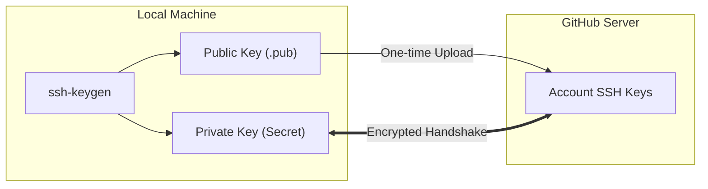
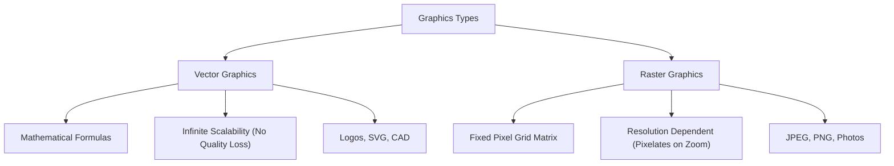

# Class Session: 06/08/26

---

## 📝 Class Notes

### Topic 1: GitHub Authentication — SSH vs HTTPS
GitHub repositories support two main protocols for network communication: SSH (Secure Shell) and HTTPS. SSH utilizes asymmetric public-private key cryptography generated via `ssh-keygen`. The public key (`.pub`) is registered on GitHub servers to identify the developer, while the private key remains strictly secret on the local host. Once configured, SSH enables seamless, passwordless pushes and pulls without entering credentials repeatedly.

In contrast, HTTPS authentication relies on web-standard protocols using a username and a Personal Access Token (PAT) or Git Credential Manager. While HTTPS is easier for beginners to set up initially without generating cryptographic key pairs, SSH provides a more secure, streamlined, and automated workflow for software development.

### Topic 2: Vector Graphics vs Raster Graphics
Vector graphics represent visual shapes through mathematical equations defining points, lines, curves, and polygons. Because vector images are calculated dynamically using geometric formulas, they are completely resolution-independent and can be scaled infinitely to any screen dimension without suffering any loss of visual quality or sharpness. Vector graphics are ideal for corporate logos, typography, vector illustrations, and CAD models.

Raster graphics, on the other hand, consist of a fixed rectangular grid (matrix) of colored pixels. Each pixel stores specific color values, making raster formats like JPEG and PNG ideal for complex photographic textures. However, raster images are resolution-dependent; enlarging a raster image requires pixel interpolation, which causes visible blurring, pixelation, and artifacts.

### Topic 3: Java 2D Graphics Fundamentals & Transformation Projects
Java 2D graphics programming relies on basic geometric primitives—such as points, line segments, rectangles, circles, polygons, and curves—to draw complex visual scenes. In Java AWT and Swing, custom drawing is performed by overriding `paintComponent(Graphics g)` and utilizing the `Graphics2D` context to draw or fill primitive shapes.

To demonstrate fundamental 2D transformations, two lab projects were assigned: `MovingTriangle.java`, which tracks real-time mouse movement using a `MouseMotionListener` and applies `AffineTransform.translate()`, and `ZoomingTriangle.java`, which uses a `javax.swing.Timer` to continuously scale a triangle using `AffineTransform.scale()`.

---

## 💡 Class Reflection — 06/08/26

### Topics Covered
- GitHub Authentication Methods (SSH vs. HTTPS)
- Vector vs. Raster Graphics Representation
- Java 2D Primitives & Geometric Transformations

### Reflections
* **SSH vs HTTPS**: Setting up SSH via `ssh-keygen` requires an initial one-time configuration, but saves time by providing passwordless authentication for all future Git operations.
* **Vector vs Raster**: Vector graphics excel in resolution independence using mathematical formulas, whereas raster graphics store pixel grids best suited for photographic detail.
* **Java 2D Transformations**: Defining shapes centered at the origin allows clean geometric transformations (translation and scaling) without mutating original vertex coordinates.
