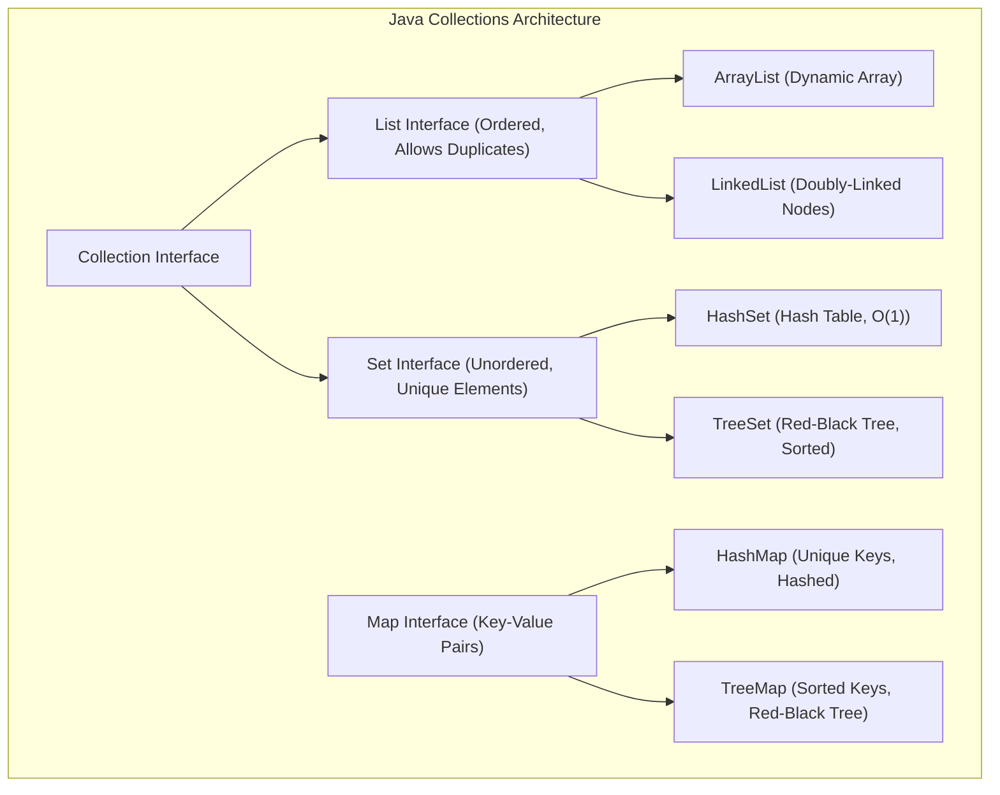
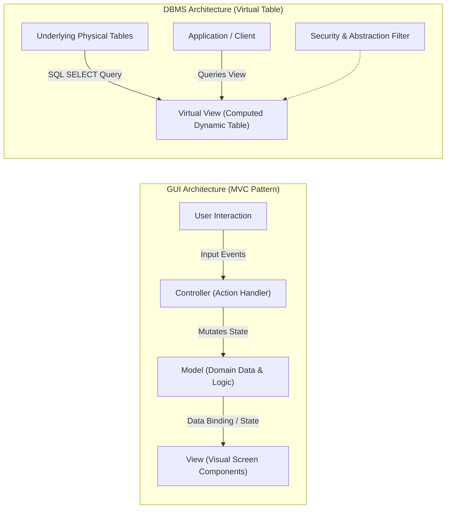
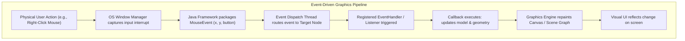
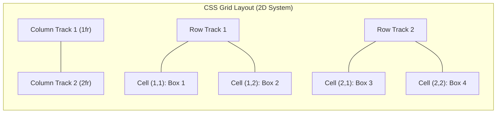
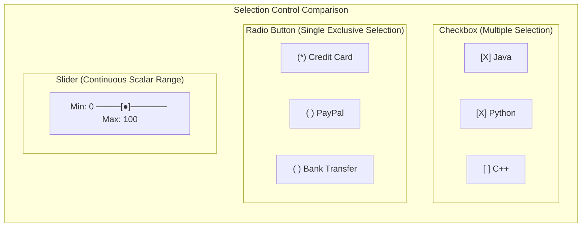
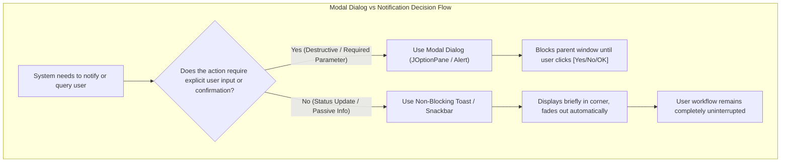
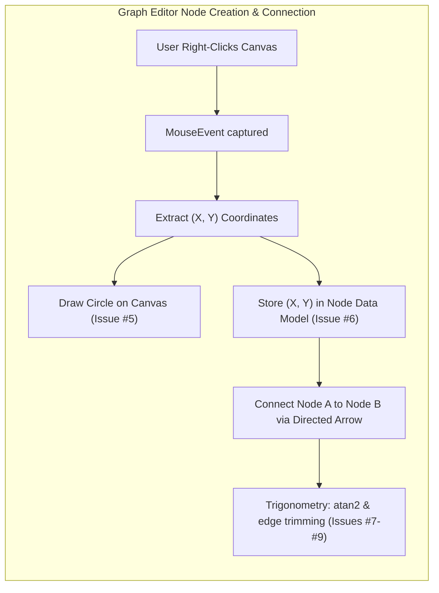

# 📝 Class Notes

### Topic 1: Java Collections Framework — Lists, Sets, and Maps
The **Java Collections Framework (JCF)** provides a standardized, unified architecture for representing, storing, and manipulating groups of objects in memory. Rather than relying on static, fixed-size arrays, collections offer dynamic data structures with rich built-in algorithmic support. The framework divides primary data management into three core abstractions: `List`, `Set`, and `Map`. A **`List`** (implemented by `ArrayList` and `LinkedList`) maintains an ordered, sequence-dependent collection where duplicate elements are permitted and elements can be accessed via integer indices. In contrast, a **`Set`** (implemented by `HashSet` and `TreeSet`) models the mathematical set abstraction, strictly enforcing uniqueness such that duplicate elements cannot exist. A **`Map`** (implemented by `HashMap` and `TreeMap`) operates independently of the root `Collection` interface, organizing data into key-value pairs where keys must be globally unique while values may be duplicated.

Selecting the appropriate collection type is determined by access patterns, performance requirements, and data constraints. `ArrayList` utilizes a dynamically resizable array that delivers fast $O(1)$ indexed retrieval but slower $O(n)$ element insertions and deletions in arbitrary positions. `LinkedList` implements a doubly-linked structure, making node insertion and removal efficient once positioned, but suffers from $O(n)$ sequential lookup overhead. For sets and maps, `HashSet` and `HashMap` utilize hashing mechanisms to provide near-constant $O(1)$ average time complexity for insertions, deletions, and search operations, though they do not guarantee iteration order. When sorted order according to natural ordering or a custom `Comparator` is required, `TreeSet` and `TreeMap` leverage self-balancing Red-Black trees to guarantee $O(\log n)$ performance across basic operations.

| Interface | Concrete Class | Ordering Guarantee | Duplicates Allowed | Underlying Data Structure |
| :--- | :--- | :--- | :--- | :--- |
| `List` | `ArrayList` | Insertion order preserved | Yes | Dynamic resizable array |
| `List` | `LinkedList` | Insertion order preserved | Yes | Doubly-linked list |
| `Set` | `HashSet` | No ordering guarantee | No | Hash table (`HashMap` instance) |
| `Set` | `TreeSet` | Sorted order (natural / `Comparator`) | No | Red-Black self-balancing tree |
| `Map` | `HashMap` | No ordering guarantee | Unique Keys, Duplicate Values | Hash table with bucket chaining |
| `Map` | `TreeMap` | Sorted by key | Unique Keys, Duplicate Values | Red-Black self-balancing tree |



```java
// Example demonstrating List, Set, and Map instantiation and usage
import java.util.*;

public class CollectionDemo {
    public static void main(String[] args) {
        // List: Ordered sequence allowing duplicates
        List<String> studentList = new ArrayList<>();
        studentList.add("Satvik");
        studentList.add("Rahul");
        studentList.add("Satvik"); // Duplicate allowed

        // Set: Enforces uniqueness
        Set<String> uniqueStudents = new HashSet<>(studentList); // Duplicates stripped

        // Map: Key-Value association
        Map<Integer, String> studentMap = new HashMap<>();
        studentMap.put(101, "Satvik");
        studentMap.put(102, "Rahul");
    }
}
```

---

### Topic 2: Concepts of "View" — GUI Architecture vs DBMS Virtual Tables
The term **"View"** carries distinct and foundational meanings across software engineering, depending on whether it is referenced within user interface design or relational database management systems. In **GUI and software architecture**, the View constitutes the visual presentation tier within the Model-View-Controller (MVC) and Model-View-ViewModel (MVVM) patterns. It represents the visual components that users perceive and interact with directly, such as screens, text fields, tables, and canvases. Under MVC separation of concerns, the **Model** encapsulates business data and domain rules, the **View** renders that data graphically to the display, and the **Controller** catches user inputs (keystrokes, mouse clicks) to mutate the Model, which subsequently updates the View. The GUI View is therefore stateful, reactive, and concerned with layout hierarchy, typography, and visual styling.

In **Database Management Systems (DBMS)**, a **View** is fundamentally a named, virtual table defined by a stored SQL `SELECT` query. Unlike physical tables, a standard DBMS view does not persistently store tuple rows on physical storage media (except in the case of materialized views); instead, the database engine dynamically evaluates the underlying query whenever the view is queried. DBMS views serve critical functions: they establish **security boundaries** by exposing only sanitized subsets of columns or rows (e.g., hiding salary figures from general staff), provide **logical data independence** by decoupling application queries from evolving schema layouts, and simplify reporting by abstracting intricate multi-table `JOIN` operations into clean virtual endpoints. While a GUI View renders graphics for human perception, a DBMS View abstracts relational data schemas for programmatic consumption.



```sql
-- Creating a DBMS View for data security and row abstraction
CREATE VIEW YoungStudents AS
SELECT ID, Name, Department
FROM Student
WHERE Age < 21;

-- Querying the virtual table as if it were a physical relation
SELECT Name, Department FROM YoungStudents;
```

---

### Topic 3: Event-Driven Programming and the Graphics Pipeline
**Event-driven programming** is an architectural paradigm where the flow of execution is determined by asynchronous user actions, operating system notifications, or hardware sensors, rather than top-down sequential procedural execution. In desktop GUI toolkits like JavaFX and Swing, the system maintains an internal event dispatch thread and an event queue. When a user performs an action—such as clicking a mouse button, pressing a key, dragging a pointer, or closing a window—the windowing subsystem packages the low-level OS interrupt into a high-level **Event object** (e.g., `ActionEvent`, `MouseEvent`, `KeyEvent`, `WindowEvent`). This event encapsulates precise contextual metadata, including screen coordinates $(x, y)$, mouse button identifiers, modifier key states (Shift, Ctrl), and the source node that originated the event.

The mechanics of handling these interactions rely on the **Observer / Listener design pattern**. A component registers an `EventHandler` or `EventListener` with a target node on the scene graph. When an event fires, the event dispatch system traverses the scene graph during the event capturing and bubbling phases, identifying registered listeners and invoking their callback methods. The callback executes domain logic—such as recalculating data, toggling visual properties, or drawing new geometry—and instructs the graphics engine to repaint or update the scene graph. The graphics pipeline then renders the updated raster buffer or scene nodes onto the display, successfully translating a physical user gesture into a visible visual transformation.

| User Action | Event Class | Java Listener Interface | JavaFX Handler Method |
| :--- | :--- | :--- | :--- |
| Clicking a button / MenuItem | `ActionEvent` | `ActionListener` | `setOnAction(e -> ...)` |
| Mouse click, enter, exit, drag | `MouseEvent` | `MouseListener` / `MouseMotionListener` | `setOnMouseClicked(e -> ...)` |
| Keyboard press, release, typed | `KeyEvent` | `KeyListener` | `setOnKeyPressed(e -> ...)` |
| Window close, iconify, focus | `WindowEvent` | `WindowListener` | `setOnCloseRequest(e -> ...)` |



```java
// JavaFX example: registering a mouse event handler to draw circles dynamically
canvas.setOnMouseClicked(event -> {
    if (event.getButton() == MouseButton.SECONDARY) { // Right-click detection
        double x = event.getX();
        double y = event.getY();
        GraphicsContext gc = canvas.getGraphicsContext2D();
        gc.setFill(Color.DODGERBLUE);
        gc.fillOval(x - 15, y - 15, 30, 30); // Draw node circle centered at click
    }
});
```

---

### Topic 4: CSS Grid Layout — Two-Dimensional Container Architecture
**CSS Grid Layout** is a native two-dimensional layout system designed for modern web user interfaces, allowing developers to organize content simultaneously along horizontal rows and vertical columns. This stands in stark contrast to **CSS Flexbox**, which is fundamentally one-dimensional and calculates space distribution primarily along a single primary axis (either row or column) with wrapping as an afterthought. By declaring `display: grid` on a parent element, that container becomes a grid context, enabling explicit track construction via `grid-template-columns` and `grid-template-rows`. Items placed inside this container are placed into grid cells defined by the intersection of vertical and horizontal grid lines, with gutter channels specified through the `gap` property.

A foundational concept within CSS Grid is the flexible unit **`fr`**, which represents a fraction of the unused, available space within the grid container. Rather than locking dimensions to rigid pixel counts or percentages that complicate responsive design, `fr` tracks dynamically recalculate as the viewport expands or contracts. For example, a configuration of `grid-template-columns: 1fr 2fr` instructs the layout engine to partition available space into three equal portions, allocating one third to the first column and two thirds to the second column. Grid offers sophisticated capabilities including track repeat functions (`repeat(auto-fit, minmax(200px, 1fr))`), named grid areas (`grid-template-areas`), and precise cell spanning, making it the premier choice for application frames, dashboard matrices, and complex tabular structures.

```css
/* Responsive two-dimensional CSS Grid container */
.container {
    display: grid;
    grid-template-columns: 1fr 2fr; /* Second column is twice the width of first */
    grid-template-rows: auto auto;
    gap: 16px;                     /* Uniform gutter spacing between tracks */
}

.box-1 { grid-column: 1 / 2; }
.box-2 { grid-column: 2 / 3; }
```



---

### Topic 5: Form Selection and Range Controls — Checkboxes, Radio Buttons, and Sliders
Form controls in user interface design must communicate constraints clearly so users immediately recognize whether an option allows multiple selections, a single mutually exclusive choice, or a value within a bounded continuum. A **checkbox** (`<input type="checkbox">` in HTML or `CheckBox` in JavaFX) represents an independent binary toggle state (checked or unchecked). When presented in a group, checkboxes allow the user to select **zero, one, or multiple options** concurrently (e.g., selecting hobbies, feature flags, or software skills). Because each checkbox functions as an autonomous entity, checking one item has no automatic side effect on neighboring checkboxes in the set.

In direct contrast, a **radio button** (`<input type="radio">` in HTML or `RadioButton` grouped in a `ToggleGroup` in JavaFX) enforces **mutual exclusivity**, requiring the user to choose **strictly one option from a predefined set** (e.g., payment method, gender, or shipping speed). All radio buttons participating in the mutually exclusive group share the same grouping identifier (`name` attribute in HTML or `ToggleGroup` instance in JavaFX); activating any radio button in the group automatically deselects whichever option was previously active. Finally, a **slider** (`<input type="range">` in HTML or `Slider` in JavaFX) enables selection across a continuous or discrete numerical range by dragging an interactive thumb across a bounded track (`min`, `max`, `step`). Sliders provide intuitive analog control for parameters where absolute precision is secondary to relative visual or sensory feedback, such as volume, brightness, zoom level, or threshold adjustment.

| Control Type | HTML Element | JavaFX Class | Selection Cardinality | Typical Use Case |
| :--- | :--- | :--- | :--- | :--- |
| **Checkbox** | `<input type="checkbox">` | `CheckBox` | $0$ to $N$ (Multiple choices) | Multi-select preferences, hobbies, terms agreement |
| **Radio Button** | `<input type="radio" name="g">` | `RadioButton` (`ToggleGroup`) | Exactly $1$ (Mutually exclusive) | Single-select choice: payment method, delivery mode |
| **Slider** | `<input type="range">` | `Slider` | Continuous / Stepped single scalar | Range values: audio volume, brightness, zoom |



---

### Topic 6: Modal Dialogs and Notification Systems in Application Design
A **dialog box** is a transient, secondary window invoked to communicate important state to the user, gather required parameters, or demand explicit confirmation before executing destructive or irreversible workflows. GUI platforms categorize dialogs into three standard archetypes: **Message Dialogs** (displaying read-only informational alerts, warnings, or error summaries), **Confirmation Dialogs** (presenting a prompt alongside explicit binary actions such as `[Yes]` and `[No]`), and **Input Dialogs** (requesting textual or parameter input via an integrated input field). In Java Swing, these dialogs are generated using static helper methods on `JOptionPane` (e.g., `showMessageDialog`, `showConfirmDialog`, `showInputDialog`), while JavaFX provides the `Alert` and `TextInputDialog` classes.

A crucial design consideration is whether an interaction should be **modal** or **non-modal**. Modal dialogs disable and block interaction with the primary parent window until the user explicitly dismisses them, guaranteeing immediate user attention and preventing race conditions or state inconsistencies during critical steps like deleting records or saving unsaved work. However, excessive use of modal dialogs causes user irritation and workflow friction ("dialog fatigue"). For non-blocking, transient notifications where no user confirmation is required—such as confirming that an auto-save completed or a background task finished—modern user interface design favors lightweight **toast notifications, snackbars, or inline banners**. Toasts appear temporarily in a corner or peripheral margin, automatically dismiss without blocking user focus, and preserve an uninterrupted interaction flow.



---

### Topic 7: JavaFX Graph Editor Architecture and Presentation Strategy
The **JavaFX Graph Editor** project constitutes an interactive desktop application engineered for constructing, positioning, connecting, and manipulating graphical node structures on a dynamic canvas. The project roadmap is structured across ten incremental development issues: from baseline project scaffolding (`#1` Gradle Initialization, `#2` JavaFX Plugin Integration), scene hierarchy architecture (`#3` Stage and Layout), and graphics configuration (`#4` Canvas Initialization), up through interactive features including `#5` Right-Click Detection and Circle Drawing, `#6` Node Coordinate Tracking, `#7` Angle Calculation, `#8` Edge-Trimmed Connectors, `#9` Arrowhead Construction, and `#10` Clear/Reset Canvas functionality. The core interactive loop centers around capturing mouse events on the canvas, instantiating circular visual primitives representing graph vertices, and maintaining their spatial coordinates to facilitate edge rendering between nodes.

When selecting an issue to present and defend before evaluators or professors, **Issue #5 (Right-Click Detection and Circle Drawing)** emerges as the premier candidate. Issue #5 cleanly demonstrates full-stack GUI competence—combining JavaFX canvas event registration, secondary mouse button identification, coordinate extraction via `event.getX()` and `event.getY()`, and immediate graphical rendering via `GraphicsContext.fillOval()`. It provides a direct, highly engaging visual demonstration without entangling the speaker in complex mathematical theory. In contrast, geometric edge issues (`#7`, `#8`, `#9`) require explaining trigonometric functions (`Math.atan2`), vector normalizations, and circle-line intersection geometry, which introduce higher defense complexity and mathematical scrutiny. Pair Issue #5 with **Issue #6 (Coordinate Tracking)** to succinctly explain how storing node centers in model classes enables the application to anchor connecting edges accurately.



```text
Summary of Presentation Recommendation:
- Best Choice: Issue #5 (Right-Click Detection & Circle Drawing)
  -> Strengths: Visual, demonstrates event handling, clean JavaFX concepts, easy to explain.
- Supporting Concept: Issue #6 (Coordinate Tracking)
  -> Strengths: Demonstrates model-view separation, explains how edges know where to connect.
- Topics to Avoid for Easy Defense: Issues #7, #8, #9 (Trigonometric edge clipping and arrowhead geometry).
```

---

# 💡 Class Reflection — 08/09/26
- **Topics Covered**: Java Collections framework, GUI View vs DBMS View, Event-driven graphics pipeline, CSS Grid layout, Form selection controls (checkbox, radio, slider), Modal dialogs vs toast notifications, JavaFX Graph Editor architecture and presentation strategy.
- **Reflections**:
  - The Collections framework demonstrates how structure dictates algorithm: selecting between List, Set, and Map hinges strictly on uniqueness constraints, ordering requirements, and key-based lookup performance.
  - While a GUI View acts as a reactive visual presentation layer in MVC architecture, a DBMS View is an abstracted virtual relation engineered to simplify complex queries and enforce data security.
  - Event-driven programming fundamentally decouples user input from screen rendering, using asynchronous listener callbacks to translate physical gestures into visual state mutations.
  - CSS Grid provides a true two-dimensional layout engine, where flexible fractional units (`fr`) enable responsive spatial division across rows and columns simultaneously.
  - Form controls convey behavioral contracts to users: checkboxes permit multi-selection, radio buttons enforce strict mutual exclusivity, and sliders allow analog exploration within bounded numeric intervals.
  - Modal dialogs should be used selectively for high-stakes decisions requiring guaranteed user intervention, while transient notifications (toasts) prevent workflow disruption for non-critical status updates.
  - Issue #5 (Right-Click Detection & Circle Drawing) offers the most effective presentation balance, highlighting core JavaFX event handling and visual rendering without the added defense risk of complex trigonometry.
