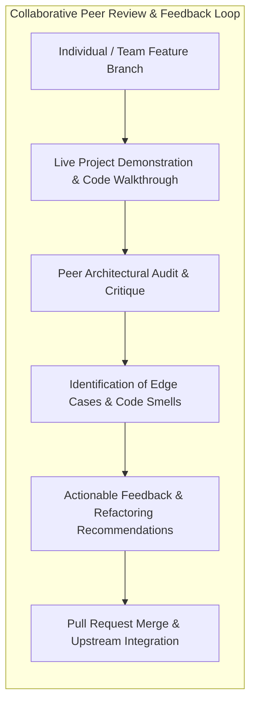
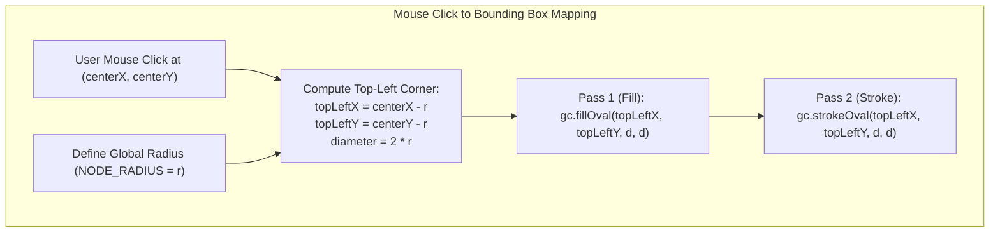
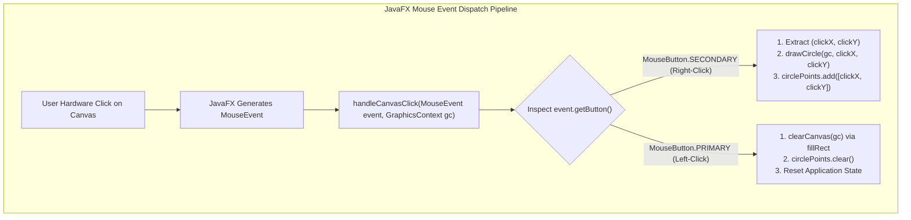
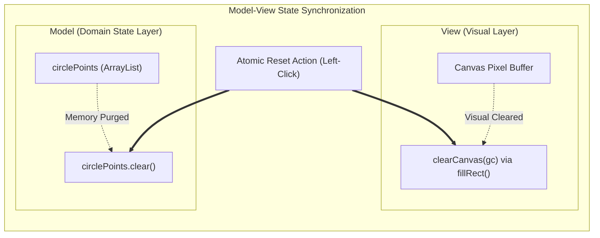
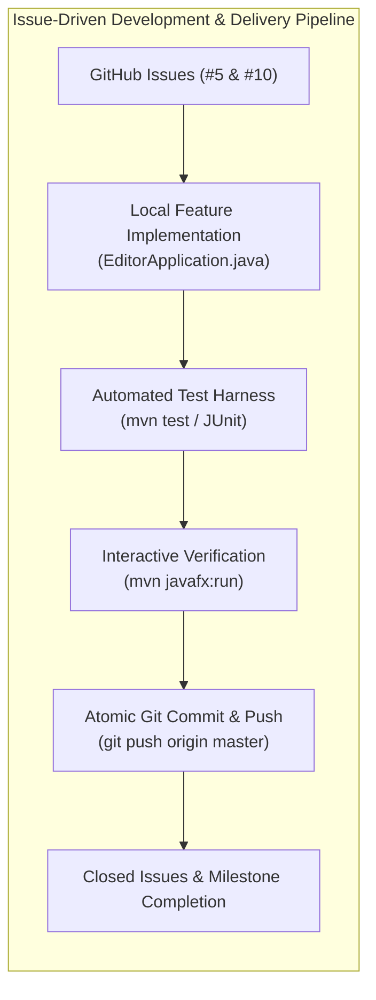

# 📝 Class Notes

### Topic 1: Cross-Project Peer Review & Collaborative Software Auditing
In collaborative software engineering, structured peer code reviews and architectural critiques serve as a crucial quality gate before integrating individual contributions into shared branches. During the classroom peer review session, students evaluated each other's graphics architectures, canvas event lifecycles, and component hierarchies. Constructive cross-team feedback emphasized maintainability, edge-case handling (such as rapid repeated clicks or out-of-bounds mouse drags), clear separation of concerns between graphical view layers and underlying domain models, and adhering to uniform styling and documentation standards across repositories.

Conducting peer reviews exposes architectural blind spots that solo developers often overlook, such as tight coupling between GUI callbacks and persistent state collections, inconsistent coordinate transformations across varying window resolutions, or unhandled null-reference vectors. By reviewing diverse implementations of interactive editors and node-connection systems across class groups, developers exchange high-yield debugging patterns, establish common conventions for event handling, and refine their own codebase to be more modular, testable, and robust against user input edge cases.

### Topic 2: JavaFX Canvas Rendering Pipeline & Centered Shape Geometry
JavaFX provides the `Canvas` node as an immediate-mode drawing surface paired with a `GraphicsContext` (2D drawing pipeline), which acts as the procedural brush and state machine. When rendering geometric nodes such as circles on a canvas, the rendering API primitives (`GraphicsContext.fillOval()` and `GraphicsContext.strokeOval()`) do not accept center coordinates directly. Instead, they require the bounding box's top-left corner `(x, y)` along with bounding width and height (`diameter = 2 * NODE_RADIUS`). Consequently, accurately centering a circular node at a mouse click coordinate `(centerX, centerY)` requires calculating a geometric offset: `topLeftX = centerX - NODE_RADIUS` and `topLeftY = centerY - NODE_RADIUS`.

Failing to compute this half-dimension offset results in an off-by-radius placement where the mouse cursor points to the bounding box vertex rather than the visual centroid of the node. To maintain visual clarity and professional aesthetics, rendering should follow a two-pass compositing approach: first invoking `fillOval()` with a solid fill color (e.g., `#3b82f6`) to establish the body, followed immediately by `strokeOval()` with a distinct border color (e.g., `#1d4ed8`) and explicit stroke line-width (`gc.setLineWidth(2.0)`). Standardizing the radius as a global class constant (`NODE_RADIUS = 20.0`) guarantees strict geometric uniformity across all dynamically spawned nodes.

### Topic 3: Event-Driven Mouse Dispatching — Primary vs. Secondary Action Routing
Graphical editors rely heavily on event-driven architectures where user hardware actions are captured by the window manager and dispatched asynchronously to registered listener interfaces. In JavaFX, attaching a lambda expression via `canvas.setOnMouseClicked(event -> handleCanvasClick(event, gc))` establishes a single point of dispatch for all mouse click varieties. Within the handler, the concrete button identity is inspected via `event.getButton()`, discerning between `MouseButton.SECONDARY` (hardware right-click, mapped to node creation) and `MouseButton.PRIMARY` (hardware left-click, mapped to canvas canvas/state reset).

Consolidating distinct mouse interactions into a unified dispatch method prevents conflicting concurrent listener callbacks and simplifies control flow. When `MouseButton.SECONDARY` is detected, the event object provides high-precision sub-pixel coordinates (`event.getX()` and `event.getY()`), which are immediately routed to the drawing routine and appended to the underlying data store. Conversely, routing `MouseButton.PRIMARY` to a dedicated reset workflow ensures that global state modifications are executed atomically within the JavaFX Application Thread, preserving UI responsiveness without risking visual frame stutter.

### Topic 4: Model-View Separation & Two-Phase State Reset
A fundamental tenet of robust graphical application design is the strict separation between the **View** (what is visually composited onto the canvas screen) and the **Model** (the internal coordinate collections in memory representing active domain entities). In the node editor implementation, the Model is represented by `List<double[]> circlePoints`, while the View is the raster pixel buffer of the `Canvas`. When implementing a reset or clear operation, developers must execute a coordinated two-phase reset: clearing the visual buffer via `clearCanvas()` and purging internal memory via `circlePoints.clear()`.

Clearing only the visual representation creates invisible ghost objects in memory that disrupt subsequent traversal or serialization operations, whereas clearing only the memory leaves orphaned visual pixels on screen that no longer correspond to addressable program entities. Furthermore, to protect internal state encapsulation, accessor methods such as `getCirclePoints()` must return an immutable wrapper via `Collections.unmodifiableList(circlePoints)`. This defensive design prevents external consumer classes from mutating internal coordinates directly, preserving class invariants and enforcing controlled lifecycle operations.

### Topic 5: Issue-Driven Git Workflow, Test Automation & Verification
Modern professional software teams employ an issue-driven development lifecycle, where feature requests, bugs, and enhancements are tracked as discrete, auditable units in GitHub Issues. In this project sprint, functional deliverables were partitioned into **Issue #5** (right-click detection, centered circle rendering, and coordinate tracking) and **Issue #10** (left-click canvas wipe and coordinate memory reset). Developers work within isolated local directories (e.g., maintaining `C:\Users\satvi\Desktop\project` separated from base course repositories), verifying build integrity through Maven (`mvn test`, `mvn javafx:run`) or Gradle (`./gradlew run`).

Automated test suites written with JUnit validate core computational logic—such as confirming that circle coordinate offsets accurately align with the node's radius, ensuring that lists accurately record sequential additions, and verifying that reset routines completely empty the list. Once tests pass, atomic Git commits explicitly referencing the issue numbers (e.g., closing issues via commit messages pushed to `origin/master`) automate project management boards, providing full traceability from initial classroom requirements to tested production code.

# 💡 Class Reflection — 17/09/26
- **Topics Covered**: Cross-Project Peer Review & Collaborative Software Auditing, JavaFX Canvas Rendering Pipeline & Centered Shape Geometry, Event-Driven Mouse Dispatching (Primary vs. Secondary Action Routing), Model-View Separation & Two-Phase State Reset, Issue-Driven Git Workflow & Automated Test Verification.
- **Reflections**:
  - Structured peer reviews uncover hidden edge cases and foster architectural consistency across collaborative software teams.
  - Offsetting mouse coordinates by the shape's radius (`click - radius`) is geometrically essential to center shapes rendered via bounding-box graphics APIs.
  - Centralizing multi-button mouse handling into a unified dispatch method cleanly decouples user input interpretation from downstream rendering logic.
  - Synchronizing the visual canvas wipe with memory list eviction prevents phantom state bugs and maintains strict model-view consistency.
  - Tracking features through GitHub issues coupled with automated Maven test suites guarantees end-to-end traceability and build reliability.
