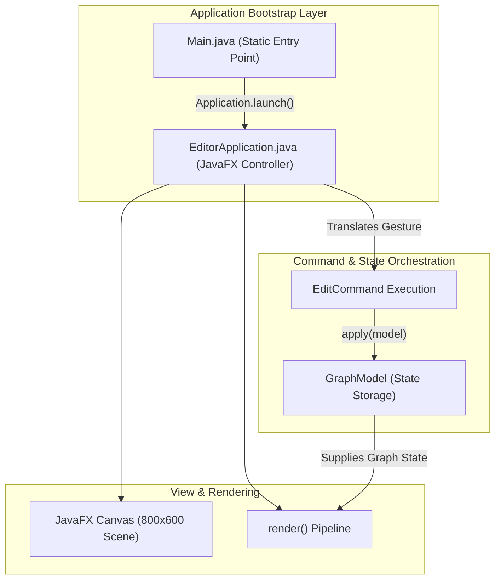
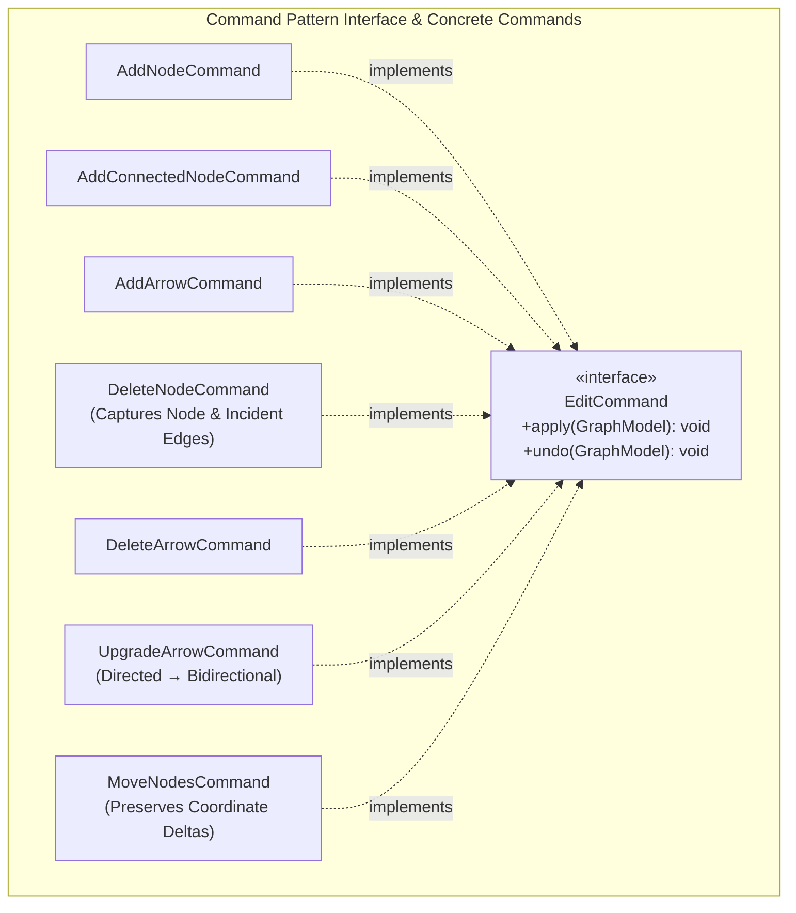
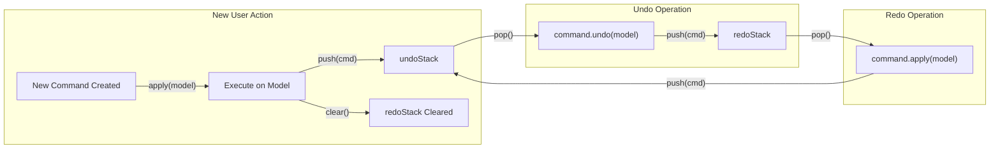

# 📝 Class Notes

### Topic 1: Desktop Graph Editor Overview, Technology Stack, and Bootstrap Architecture
The CSC360 Graph Editor is an interactive desktop application engineered using Java 21, JavaFX 23, Apache Maven, and JUnit 5, designed to provide a dynamic 800×600 canvas for constructing, editing, and managing directed and bidirectional graph topologies. The architecture strictly enforces a separation between application bootstrapping and user interface control. `Main.java` serves solely as the minimal launch wrapper that delegates execution to `EditorApplication.java`. Decoupling the static `main(String[] args)` entry point from the JavaFX `Application` subclass prevents common module-path and launcher initialization pitfalls encountered in modern modular JavaFX environments (such as runtime classpath conflicts and missing module descriptor errors).

`EditorApplication.java` acts as the primary controller and orchestration engine for the client. It initializes the JavaFX `Stage`, constructs the scene graph hierarchy (canvas, toolbar, status readout), attaches event listeners for user input, manages rendering cycles, and delegates all domain mutations to command abstractions. Rather than directly modifying graph data structures inside mouse event handlers, `EditorApplication` translates raw user gestures—such as clicks, drags, and key combinations—into semantic editing requests. This separation isolates user input handling from state management and ensures the view remains a passive observer of the underlying model.

### Topic 2: Graph Domain Modeling & Immutability — `GraphModel`, `GraphNode`, and `GraphArrow`
The domain layer encapsulates graph state within `GraphModel.java`, which maintains collections of vertices and edges indexed by integer identifiers. To guarantee deterministic iteration order during rendering and serialization while preserving O(1) average-time complexity for lookups, insertions, and removals, the model stores vertices and edges internally using `LinkedHashMap<Integer, GraphNode>` and `LinkedHashMap<Integer, GraphArrow>`. Beyond raw storage, `GraphModel` acts as a spatial and relational query engine, exposing methods to query vertices at specific coordinates, identify edges intersected by mouse coordinates, evaluate degree connectivity, and dynamically generate monotonic entity IDs.

Data integrity is fortified through the design of `GraphNode.java` and `GraphArrow.java` as immutable value representations. Rather than permitting external mutation of coordinate fields (`x`, `y`) or bidirectional state flags via direct setter calls, `GraphNode` provides functional copy mutators such as `withPosition(double newX, double newY)`. This functional immutability prevents unintended side effects, aliasing bugs, and race conditions across the rendering loop and undo history stacks. When an arrow's directional semantics change from a unidirectional directed edge to a bidirectional link, `GraphArrow` similarly produces a revised instance with an updated boolean flag, ensuring snapshot integrity across command executions.

### Topic 3: The Command Design Pattern for Reversible Actions (`EditCommand` Hierarchy)
The core architecture of the Graph Editor hinges on the Command Design Pattern to cleanly decouple user interface event triggers from domain mutations. Every mutating action is encapsulated within an implementation of the `EditCommand` interface, which defines two foundational contracts: `apply(GraphModel model)` to execute the mutation, and `undo(GraphModel model)` to invert it. By treating state transitions as first-class objects, the system eliminates ad-hoc conditional logic across the controller and ensures that every graph modification encapsulates both forward and backward operational semantics.

The command hierarchy comprises granular operations as well as compound mutations tailored to graph integrity. Fundamental commands include `AddNodeCommand`, `AddArrowCommand`, `DeleteArrowCommand`, and `UpgradeArrowCommand` (which transitions directed arrows to bidirectional edges). To preserve graph topology during compound actions, `AddConnectedNodeCommand` atomically binds node creation with incident arrow insertion, ensuring both are reversed simultaneously. Crucially, `DeleteNodeCommand` addresses relational dependencies: prior to removing a target vertex from `GraphModel`, it captures a snapshot of the vertex and all incident arrows; upon `undo()`, it restores the vertex and reconnects the preserved edge relationships in proper order, preventing orphaned edges or corrupted topologies. Similarly, `MoveNodesCommand` records coordinate deltas (`dx`, `dy`) across multi-node selections, restoring precise spatial geometry on rollback.

### Topic 4: Dual-Stack Undo/Redo Engine & Custom `LinkedStack<T>` Data Structure
Rather than relying on `java.util.Stack`—which suffers from legacy architectural flaws, including synchronisation overhead from extending `java.util.Vector` and violation of stack encapsulation via index-based access—the editor implements a dedicated generic `LinkedStack<T>` using an internal singly-linked list. Each node encapsulates data alongside a reference to its successor, enabling `push()`, `pop()`, and `peek()` operations to execute with guaranteed O(1) time complexity and zero memory reallocation overhead. The stack strictly enforces Last-In, First-Out (LIFO) access, providing safe memory bounds and predictable garbage collection behavior for history tracking.

The undo/redo engine coordinates two distinct instances of `LinkedStack<EditCommand>`: `undoStack` and `redoStack`. When a user initiates a mutation, the controller executes `command.apply(model)`, pushes the command onto `undoStack`, and calls `redoStack.clear()`. Pressing Undo pops the latest command from `undoStack`, invokes `command.undo(model)`, and pushes it onto `redoStack`. Pressing Redo pops from `redoStack`, invokes `command.apply(model)`, and pushes the command back onto `undoStack`. Clearing `redoStack` upon the execution of any new action is mathematically necessary: branching histories cannot be maintained linearly, and executing an alternate mutation invalidates previously un-done operations, ensuring a strictly linear and deterministic timeline.

### Topic 5: Interaction Disambiguation & Gesture Mechanics (Click vs. Drag & Multi-Selection)
A primary challenge in interactive canvas engineering is distinguishing between intentional static mouse clicks and drag operations. `EditorApplication` resolves this ambiguity by recording initial mouse coordinates (`pressX`, `pressY`) on `MOUSE_PRESSED` and computing the Euclidean displacement distance upon `MOUSE_RELEASED`. If the displacement is less than or equal to a strict threshold (5 pixels), the interaction is classified as a stationary click; displacements exceeding this threshold are classified as drags. This filtering prevents accidental micro-movements of the mouse from triggering unintended dragging or node translation when a user attempts a simple selection or deletion.

The application supports a rich set of contextual mouse gestures mapped to specific editing commands. A stationary right-click on an empty canvas region dispatches an `AddNodeCommand`, while right-clicking an existing node sets it as selected. Right-clicking the canvas while a node is selected triggers an `AddConnectedNodeCommand`, simultaneously instantiating a new node and a directed edge originating from the active selection. For multi-entity manipulation, holding the `Shift` modifier key while clicking nodes accumulates them into an active selection set; dragging any selected node computes uniform coordinate offsets (`dx`, `dy`) across the entire set, dispatching a single consolidated `MoveNodesCommand` upon release.

### Topic 6: Computational Geometry & Hit Detection (`GeometryUtils`)
Visual fidelity and geometric precision are delegated to `GeometryUtils.java`, removing complex mathematical routines from the controller. A key problem in graph rendering is preventing arrow shafts and arrowheads from penetrating circular node boundaries. To achieve clean perimeter connections, `GeometryUtils` calculates the relative angle between node centers using `Math.atan2(dy, dx)`. The arrow's start coordinate is shifted forward along this angle by the source node's radius (`xStart = x1 + R * cos(θ)`, `yStart = y1 + R * sin(θ)`), while the termination coordinate is shifted backward from the target node's center by its radius (`xEnd = x2 - R * cos(θ)`, `yEnd = y2 - R * sin(θ)`). This ensures arrows terminate flush against the outer perimeter of both nodes.

Hit detection on thin directed edges presents another geometric challenge, as requiring exact pixel-perfect clicks on 1-pixel or 2-pixel lines degrades usability. `GeometryUtils` implements an orthogonal point-to-segment distance algorithm via `pointToSegmentDistance(px, py, x1, y1, x2, y2)`. By projecting the mouse coordinate vector onto the line segment vector using dot-product scalar projection clamped between [0, 1], the method determines the closest Euclidean distance from the cursor to the arrow shaft. Clicks falling within a configurable tolerance buffer (approximately 6 pixels) are registered as positive edge hits, allowing effortless edge selection and deletion.

```mermaid
flowchart TD
    subgraph EdgeClipping ["Arrow Boundary Clipping Geometry"]
        N1["Node 1 Center (x1, y1)"] -->|"Vector offset: +R*cos(θ), +R*sin(θ)"| S["Arrow Start (Perimeter)"]
        S -->|"Line Segment Length: D - 2R"| E["Arrow End (Perimeter)"]
        E -->|"Vector offset: -R*cos(θ), -R*sin(θ)"| N2["Node 2 Center (x2, y2)"]
    end
    subgraph HitDetection ["Point-to-Segment Hit Detection"]
        C["Mouse Click (px, py)"] -->|"Perpendicular Projection"| L["Line Segment P1-P2"]
        L -->|"Distance <= 6px Threshold"| HIT["Register Edge Hit"]
    end
```

### Topic 7: Transient UI Kinematics vs. Model Invariance (`PullMotionModel`)
Modern user interfaces utilize physics-inspired visual feedback to enhance direct manipulation. The Graph Editor incorporates `PullMotionModel.java` to render interactive "pull" and "snap" dynamics when a user drags a new connection arrow near potential target nodes. As the mouse pointer approaches a candidate node, the candidate visually displaces toward the cursor using non-linear easing and interpolation formulas, providing dynamic visual affordance that signals a valid connection target.

Crucially, the system enforces a strict distinction between transient visual displacement and persistent model state. Visual deformations computed by `PullMotionModel` are applied exclusively during the rendering pipeline within `render()` to transform the drawing coordinates on the `GraphicsContext`. The underlying coordinate values stored within `GraphModel` remain completely unmodified throughout the drag interaction. Preserving model invariance prevents floating-point drift, ensures deterministic serialization, and prevents transient animations from corrupting graph topology or polluting the undo/redo history.

### Topic 8: Custom Serialization & Monotonic ID Management (`GraphJsonCodec`)
Persistence in the Graph Editor is handled by `GraphJsonCodec.java`, which provides custom JSON serialization and deserialization without external dependencies. Avoiding third-party libraries like Jackson or Gson minimizes deployment footprint, eliminates transitive dependency vulnerabilities, and satisfies strict standalone educational constraints. The codec manually structures vertices and edges into a standardized JSON schema containing arrays of node descriptors (`id`, `x`, `y`) and arrow descriptors (`id`, `source`, `target`, `bidirectional`), utilizing robust string parsing and tokenization routines to reconstitute `GraphModel` instances.

A critical engineering challenge during graph deserialization is maintaining entity identity and preventing identifier collisions. If an imported graph contains existing entity IDs (e.g., vertices 1, 2, 3, and 8), creating new entities using a hardcoded counter starting at 1 would cause immediate primary key collisions and corrupt the internal `LinkedHashMap` storage. `GraphJsonCodec` inspects the maximum identifier present across all restored nodes and arrows (`maxId = max(all_ids)`), re-anchoring the model's next identifier sequence to `maxId + 1`. This monotonic ID allocation ensures complete continuity between deserialized graphs and newly appended entities.

### Topic 9: Verification, Quality Assurance & Viva Defense Strategy
The integrity of the Graph Editor is verified through an automated JUnit 5 test suite comprising approximately 27 test cases. The testing strategy emphasizes structural invariants and state reversibility: every concrete command is tested against the fundamental property `model == apply(undo(apply(model)))`, verifying that executing and subsequently reversing an operation returns `GraphModel` to its exact prior state. Additional unit tests validate geometric calculations in `GeometryUtils` against mathematical edge cases, verify LIFO push/pop/peek contracts in `LinkedStack<T>`, and test JSON round-trip fidelity through save-and-load validation.

For viva examinations and technical presentations, project defense centers on explaining architectural trade-offs and structural decoupling. Key viva focal points include articulating why the Command Pattern is essential for multi-level undo/redo, justifying the custom `LinkedStack` over `java.util.Stack` (avoiding legacy synchronization and vector inheritance), explaining why `redoStack` must be cleared on new mutations, detailing boundary offset trigonometry in `GeometryUtils`, and defending the immutability of `GraphNode` to eliminate aliasing bugs. Build and execution targets are orchestrated via the Maven Wrapper (`.\mvnw.cmd javafx:run` for application execution, and `.\mvnw.cmd test` for test suite execution), demonstrating standard reproducible build practices.

# 💡 Class Reflection — 29/09/26
- **Topics Covered**: Desktop Graph Editor Overview & Bootstrap Architecture, Graph Domain Modeling & Immutability, Command Design Pattern & Reversibility, Dual-Stack Undo/Redo Engine & Custom LinkedStack, Interaction Disambiguation & Gesture Mechanics, Computational Geometry & Hit Detection, Transient UI Kinematics vs. Model Invariance, Custom Serialization & Monotonic ID Management, Verification & Viva Defense Strategy.
- **Reflections**:
  - Separating the static bootstrap (`Main`) from the JavaFX controller (`EditorApplication`) eliminates runtime classpath pitfalls while establishing an event-driven, decoupled GUI architecture.
  - Modeling graph nodes and arrows as immutable value objects backed by `LinkedHashMap` prevents aliasing side effects and ensures deterministic iteration order during rendering.
  - Encapsulating domain mutations within an `EditCommand` hierarchy establishes uniform forward (`apply`) and backward (`undo`) semantics essential for clean state restoration.
  - Implementing a custom singly-linked `LinkedStack<T>` achieves strict O(1) history tracking, while clearing `redoStack` upon new actions guarantees a strictly linear timeline.
  - Establishing a 5-pixel displacement threshold effectively filters static clicks from drags, enabling distinct gesture disambiguation for node creation, connection, and multi-selection.
  - Offsetting arrow endpoints by circle radii using trigonometric angles (`atan2`) and implementing orthogonal point-to-segment distance projections delivers clean visual boundaries and intuitive hit detection.
  - Isolating dynamic pulling animations within `PullMotionModel` ensures responsive visual feedback without contaminating persistent coordinate data in `GraphModel`.
  - Handcrafted JSON codecs minimize external dependencies, while re-anchoring entity sequences to `maxId + 1` prevents primary key collisions upon deserialization.
  - Validating command reversibility invariants (`apply-undo-apply`) with JUnit 5 automated tests guarantees regression-free state transitions and solidifies viva defense preparation.
