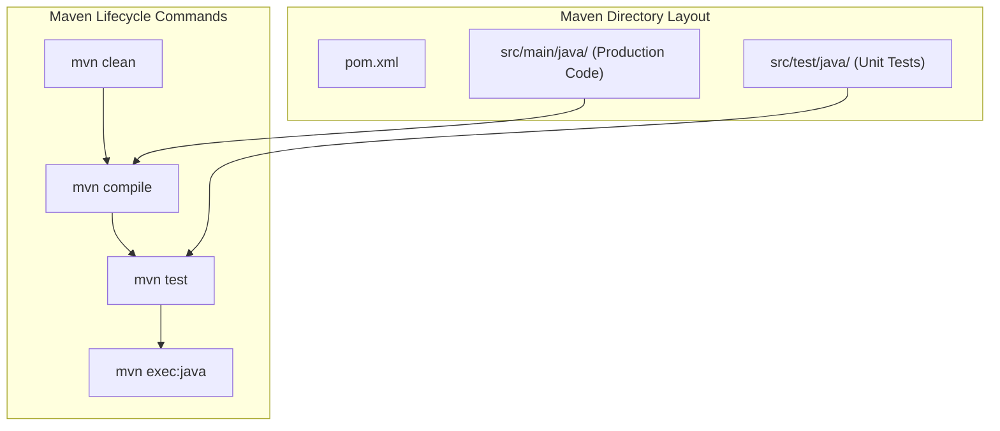
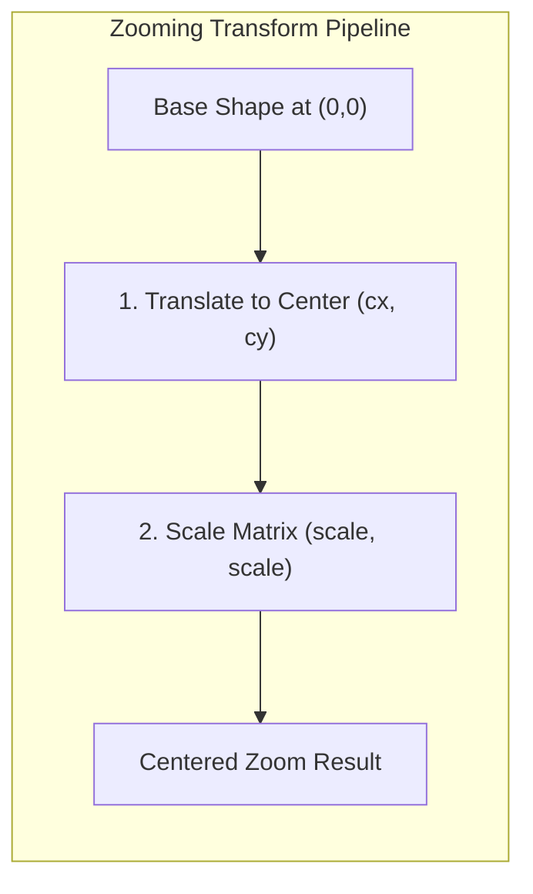

# Class Session: 13/08/26

---

## 📝 Class Notes

### Topic 1: Maven Build System Architecture
Apache Maven is a project management and build automation framework for Java. Maven introduces a standardized Project Object Model (`pom.xml`) that defines project coordinates (`groupId`, `artifactId`, `version`), JDK compiler versions, and external dependencies. Maven automates compilation, testing, packaging, and execution through a clean, declarative build lifecycle.

The standard Maven directory structure enforces strict separation of concerns. Production Java source files reside under `src/main/java/`, unit tests are placed in `src/test/java/`, and build outputs (`.class` files and JARs) are placed in the `target/` directory. This structure allows developer tools and CI/CD pipelines to build projects automatically without custom scripting.

### Topic 2: Implementation of 2D Transformations (Moving & Zooming Triangles)
2D geometric transformations manipulate shape coordinates using matrix operations. In `MovingTriangle.java`, an equilateral triangle is defined around the origin `(0, 0)` using `Path2D.Double`. A `MouseMotionListener` captures mouse coordinates `(mouseX, mouseY)` on cursor movement. Inside `paintComponent()`, `AffineTransform.translate(mouseX, mouseY)` creates a transformed shape copy, positioning the triangle centroid under the cursor without modifying the base shape.

In `ZoomingTriangle.java`, continuous scaling animation is driven by a 30ms `javax.swing.Timer`. The `scale` variable oscillates between `MIN_SCALE` (0.4) and `MAX_SCALE` (2.5). Order of transformation is critical: `AffineTransform.translate(cx, cy)` is applied *before* `AffineTransform.scale(scale, scale)` so that scaling occurs around the panel's center rather than the top-left window origin `(0, 0)`.

### Topic 3: Java GUI Framework Evolution (AWT, Swing, JavaFX)
Java GUI development has evolved across three major frameworks. AWT (Abstract Window Toolkit) was Java's first UI library, relying on OS-native "heavyweight" components. Swing improved on AWT by introducing "lightweight" 100% pure Java components painted directly onto canvas surfaces (`JPanel`, `JFrame`), allowing consistent cross-platform Look-and-Feel and double buffering.

Modern Java applications utilize JavaFX, a complete replacement for Swing that supports hardware-accelerated 2D/3D graphics, FXML declarative UI templates, and CSS styling. Understanding how Swing manages repaints on the Event Dispatch Thread (EDT) via `paintComponent(Graphics g)` is foundational for interactive graphics programming.

---

## 💡 Class Reflection — 13/08/26

### Topics Covered
- Maven Project Layout & Build Lifecycle (`pom.xml`)
- 2D Geometric Transformations (Translation & Centered Scaling)
- Java GUI Framework Evolution (AWT, Swing, JavaFX)

### Reflections
* **Maven Architecture**: Adopting standard Maven project layouts (`pom.xml`) simplifies dependency management and automates build lifecycles across development environments.
* **2D Transformations**: Matrix transformation ordering is critical; translating to the container center before scaling ensures objects zoom around their own centroid.
* **GUI Frameworks**: Transitioning from AWT heavyweight components to Swing lightweight rendering provides cross-platform UI consistency and smooth custom painting.
