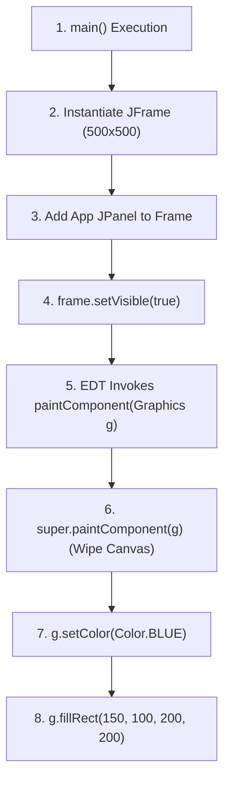
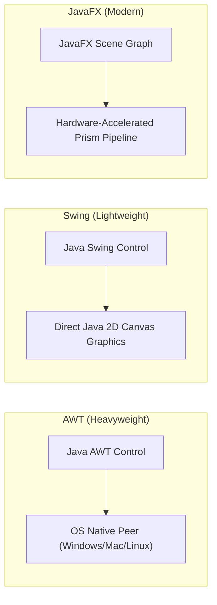

# Class Session: 18/08/26

---

## 📝 Class Notes

### Topic 1: Detailed Rendering Algorithm of Maven Square (`App.java`)
The Maven Square application (`App.java`) is a foundational Java Swing program demonstrating custom 2D graphics rendering on a `JPanel`. The execution begins in `main()`, where a `JFrame` window is instantiated with dimensions of 500x500 pixels and configured with `setDefaultCloseOperation(JFrame.EXIT_ON_CLOSE)` to ensure clean process termination upon window closure. The custom `App` panel (which extends `JPanel`) is instantiated and added to the frame's content pane.

When `frame.setVisible(true)` is invoked, control delegates to the Swing Event Dispatch Thread (EDT). The EDT triggers the component repainting cycle by calling `paintComponent(Graphics g)`. Inside `paintComponent()`, `super.paintComponent(g)` is executed first to wipe the background canvas and prepare the graphics context. Next, `g.setColor(Color.BLUE)` sets the active rendering brush to Blue, and `g.fillRect(150, 100, 200, 200)` performs scanline rasterization, rendering a solid 200x200 pixel square with its top-left origin at coordinate `(150, 100)`.

### Topic 2: Deep-Dive into Java GUI Frameworks (AWT vs Swing vs JavaFX)
Java provides three major graphical frameworks for building desktop applications. AWT (Abstract Window Toolkit) is Java's original GUI library, relying on OS-native peer components ("heavyweight" widgets). Because AWT relies on native windowing systems, component behavior and appearance vary across platforms, and custom 2D graphics operations are constrained by underlying OS windowing peers.

Swing introduced "lightweight" components written entirely in Java (`javax.swing`), which paint custom pixel content directly onto canvas surfaces (`JPanel`, `JFrame`). Swing provides cross-platform consistency, customizable Look-and-Feel, and built-in double buffering to eliminate screen flickering. JavaFX is the modern replacement for Swing, offering a scene-graph architecture, hardware-accelerated 2D/3D graphics pipelines, CSS styling, and XML-based UI definitions (FXML).

### Topic 3: Maven Project Folder Layout (`maven-square`)
Organizing Java projects using Apache Maven enforces a standardized directory layout recognized across build tools and IDEs. The root directory contains `pom.xml`, which specifies project coordinates (`groupId`, `artifactId`, `version`), dependencies (e.g., JUnit), and compiler settings. Production Java code resides in `src/main/java/` under proper package namespaces (e.g., `com.example.App`).

Automated test suites are placed in `src/test/java/` (e.g., `AppTest.java`), ensuring unit tests are kept separate from production source code. When Maven compiles a project using `mvn compile`, the output bytecode (`.class` files) is placed in `target/classes/`. This clean separation ensures build artifacts are easily excluded from version control via `.gitignore`.

---

## 💡 Class Reflection — 18/08/26

### Topics Covered
- Step-by-Step Rendering Algorithm (`App.java`)
- Java GUI Architecture Comparison (AWT vs Swing vs JavaFX)
- Standard Maven Directory Layout & Build Lifecycle (`maven-square`)

### Reflections
* **Rendering Algorithm**: Invoking `super.paintComponent(g)` first is essential in Swing to clear previous pixel buffers before executing custom shape primitive commands.
* **GUI Frameworks**: Swing lightweight components offer total control over 2D painting primitives, whereas AWT heavyweight peers are limited by underlying OS controls.
* **Maven Folder Layout**: Standardizing project layouts (`src/main/java`) ensures smooth compilation, dependency management, and build reproducibility across development environments.
