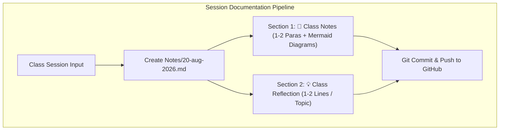
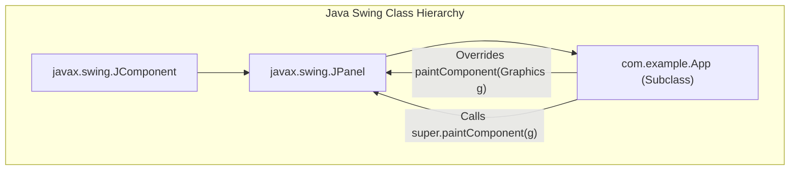
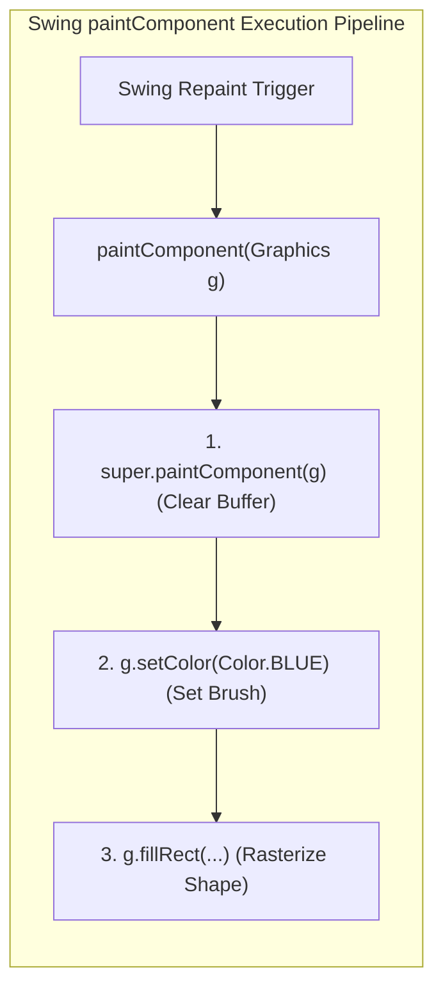
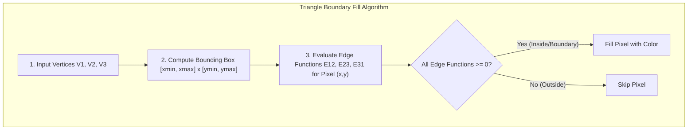

# Class Session: 20/08/26

---

## 📝 Class Notes

### Topic 1: GitHub Review & Workspace Rules for Notes and Reflection Documents
Reviewing GitHub integration workflows reinforced the importance of consistent version control, repository synchronization (`git push origin main`), and SSH key authentication. To maintain high-quality documentation across the project lifecycle, standardized workspace rules were established in `.agents/AGENTS.md`. These guidelines mandate creating structured Markdown session documents named as `<DD>-aug-<YYYY>.md` within the `Notes/` directory.

Each session document is strictly partitioned into two main sections: a detailed **Class Notes** section and a concise **Class Reflection** section. Class notes require 1 to 2 comprehensive paragraphs per topic accompanied by visual Mermaid diagrams or flowcharts to illustrate architectural workflows. Class reflections require a date header, topic list, and concise 1 to 2 line key takeaways per point.

### Topic 2: Java Classes, Subclasses, Inheritance & `@Override` Annotation
Object-Oriented Programming (OOP) in Java relies heavily on inheritance, where a subclass inherits fields and methods from a superclass using the `extends` keyword (for example, `public class App extends JPanel`). Inheritance allows subclasses to reuse superclass functionality while defining specialized behaviors. The `super` keyword refers directly to the immediate parent class, enabling subclasses to invoke overridden superclass methods like `super.paintComponent(g)`.

The `@Override` annotation is a compiler directive placed above overridden methods. It explicitly informs the Java compiler that the method is intended to override a method declared in a superclass or interface. If the method signature does not match any parent method (such as a typo in method name or parameters), the compiler raises a compile-time error, preventing subtle runtime bugs.

### Topic 3: Maven Project Architecture & Swing Component Painting Rationale
In Maven-managed Java Swing applications like `maven-square`, utilizing `@Override` and `super` is essential for thread safety and reliable build compilation. Maven compiles application code using `mvn compile` against target JDK specifications. The `@Override` annotation ensures that custom Swing panels correctly match internal Swing component contracts across different Java versions without breaking during automated build lifecycles.

Inside Swing's double-buffered rendering engine, components delegate custom painting to `paintComponent(Graphics g)`. Calling `super.paintComponent(g)` as the first line inside an overridden paint method is critical: it executes `JPanel`'s default painting logic to wipe the background canvas clean and initialize the graphics buffer state. Omitting `super.paintComponent(g)` causes visual artifacts, trailing ghosts, and corrupted screen redraws.

### Topic 4: Primitive Line/Triangle Drawing & Boundary Fill Algorithm for Triangles
Drawing 2D primitive shapes in Java AWT/Swing involves specifying coordinates for points, line segments (`g.drawLine()`), and closed polygons (`Path2D.Double` or `Polygon`). Triangles represent the fundamental geometric primitive in computer graphics because any complex 2D or 3D polygon mesh can be decomposed into a collection of triangular faces.

The Boundary Method (Half-Plane / Bounding Box Rasterization Algorithm) fills triangles efficiently:
1. **Bounding Box Calculation**: Given triangle vertices $V_1(x_1, y_1)$, $V_2(x_2, y_2)$, and $V_3(x_3, y_3)$, determine the bounding box bounds $[x_{\min}, x_{\max}] \times [y_{\min}, y_{\max}]$.
2. **Edge Function Proof**: Each edge $(V_i, V_j)$ defines an implicit line equation (edge function):
   $$E_{ij}(x, y) = (x - x_i)(y_j - y_i) - (y - y_i)(x_j - x_i)$$
   * Proof: $E_{ij}(x, y) > 0$ means point $(x,y)$ lies to the right of the directed edge, $E_{ij}(x, y) < 0$ means left, and $E_{ij}(x,y) = 0$ lies exactly on the boundary edge.
3. **Boundary Test & Pixel Fill**: Iterate through each pixel $(x, y)$ within the bounding box. If all three edge functions satisfy $E_{12}(x,y) \ge 0$, $E_{23}(x,y) \ge 0$, and $E_{31}(x,y) \ge 0$, the pixel lies inside or on the boundary of the triangle and is colored.

---

## 💡 Class Reflection — 20/08/26

### Topics Covered
- GitHub Notes Guidance & Standardized Workspace Rules
- Java Classes, Subclasses, Inheritance & `@Override` Annotation
- Maven Project Architecture & `super.paintComponent(g)` Rationale
- Primitive Line/Triangle Drawing & Boundary Fill Algorithm Proof

### Reflections
* **GitHub Guidance & Rules**: Enforcing standardized session files (`20-aug-2026.md`) with 1-2 paragraph notes, visual diagrams, and concise reflections maintains high documentation quality across commits.
* **Java Subclasses & `@Override`**: Using `extends` enables OOP inheritance, while `@Override` guarantees compile-time checking against parent signatures and `super` allows invoking parent methods safely.
* **Maven & Swing Painting**: Calling `super.paintComponent(g)` is vital in Swing applications to erase previous frame buffers before drawing custom graphics primitives.
* **Boundary Method for Triangles**: The boundary algorithm uses 2D cross-product edge functions $E_{ij}(x,y) \ge 0$ over a bounding box to determine whether pixels lie inside a triangle.
