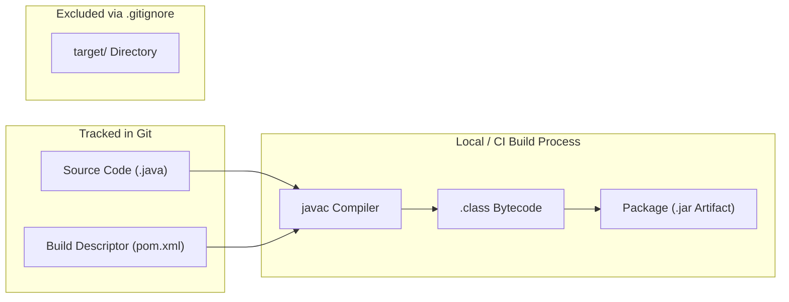
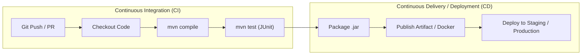

# 📝 Class Notes

### Topic 1: Java Compilation Artifacts — `.class` Files, JAR Files, and Git Best Practices
In Java, compilation converts human-readable source code (`.java`) into platform-independent bytecode stored in `.class` files via the `javac` compiler. A Java Archive (`.jar`) is a compressed ZIP-format package that bundles multiple compiled `.class` files, auxiliary resources (images, configurations), and an optional manifest file (`META-INF/MANIFEST.MF`) into a single distributable artifact. JAR files serve either as executable applications (when a `Main-Class` entry is present) or as reusable third-party libraries.

In source control management, binary and generated files such as `.class` files, `.jar` packages, and the `target/` build directory must never be committed to a GitHub repository. Storing compiled binaries bloats repository size, creates unmergeable binary merge conflicts, and risks committing environment-specific build discrepancies. Instead, repositories should only track source code and build descriptor files (such as `pom.xml`), allowing developers and automated build pipelines to reliably reproduce binaries from scratch.

### Topic 2: Role of `pom.xml` in Maven Packaging & JAR Generation
The `pom.xml` (Project Object Model) file orchestrates the complete build lifecycle, from source compilation to artifact packaging. Maven provides standard packaging options such as `<packaging>jar</packaging>` and utilizes plugins like `maven-jar-plugin` or `maven-assembly-plugin` to assemble class files and embed classpath references. Through `pom.xml`, developers specify the manifest configuration, pointing to the application's entry point (`Main-Class`) to produce directly executable JARs via `java -jar app.jar`.

Without `pom.xml`, packaging a multi-dependency Java project requires tedious manual scripting and classpath configuration. Maven standardizes this process, ensuring that the resulting JAR conforms to standard conventions and is accompanied by generated metadata for dependency management in downstream projects.

### Topic 3: Continuous Integration (CI) and Continuous Delivery/Deployment (CD)
Continuous Integration (CI) is a software engineering practice where developers frequently merge code changes into a central repository, triggering automated build and test suites (e.g., via GitHub Actions, GitLab CI, or Jenkins). CI automatically validates that newly pushed code compiles, passes all unit tests, and adheres to code quality standards, catching integration bugs early before they reach production.

Continuous Delivery (CD) extends CI by automating the release preparation pipeline, ensuring that every validated build artifact (such as a JAR or container image) can be released to staging or production at the push of a button. Continuous Deployment takes this a step further by automatically deploying every passing build directly to live environments without manual intervention, dramatically reducing release cycle times.

### Topic 4: Character Encoding in Java — UTF-8 and Portability
Character encoding translates characters (letters, numbers, symbols) into byte sequences. UTF-8 is the dominant variable-width Unicode encoding standard capable of representing every character in the Unicode table while maintaining backward compatibility with ASCII. In Java, if source files or compiler encodings are not explicitly defined, the Java compiler defaults to the host operating system's default charset (e.g., Windows-1252 on Windows vs. UTF-8 on Linux/macOS), leading to corrupted string literals and character rendering discrepancies across platforms.

To ensure deterministic, cross-platform builds, Maven projects should explicitly declare `<project.build.sourceEncoding>UTF-8</project.build.sourceEncoding>` in the `<properties>` block of `pom.xml`. This guarantees that string literals, comments, and internationalized text compile consistently regardless of the OS environment running the build.

### Topic 5: Java Source Version vs. Target and Runtime Version
The Java platform distinguishes between the source version, the target/release bytecode version, and the runtime JVM environment. The **source version** (configured via `<maven.compiler.source>` or `javac -source`) dictates which language syntax and features (e.g., lambdas in Java 8, records in Java 16) are permitted in the source files. The **target version** (or modern `<maven.compiler.release>`) specifies the major bytecode class file format generated for compatibility with specific JVM versions.

The **runtime version** is the actual Java Virtual Machine (JRE/JDK) executing the application. Java maintains backward compatibility (newer JVMs run older bytecode), but forward compatibility is strictly disallowed: running bytecode compiled with a higher target version on an older JVM triggers an `UnsupportedClassVersionError`.

### Topic 6: Unit Testing & JUnit Framework in Software Engineering
Unit testing is the practice of testing the smallest testable units of software—individual methods and classes—in strict isolation from external systems. JUnit is the industry-standard Java unit testing framework, providing declarative annotations (such as `@Test`, `@BeforeEach`, `@AfterEach`, and `@ParameterizedTest`) along with assertion libraries (`assertEquals`, `assertTrue`, `assertThrows`) to verify expected behavior against actual program output.

Automated unit tests serve as executable specifications and a safety net for developers. They enable confident refactoring, accelerate debugging, and prevent regression bugs when codebase modifications are introduced. In automated CI/CD pipelines, Maven's `maven-surefire-plugin` runs JUnit tests automatically during `mvn test`, halting the build immediately if any assertion fails.

### Topic 7: Maven Dependency Management in `pom.xml`
Maven manages external libraries declaratively through the `<dependencies>` section of `pom.xml`. Each dependency is uniquely identified by its coordinate triplet: `groupId` (organization/package namespace), `artifactId` (library identifier), and `version`. Additionally, the `<scope>` tag defines classpath visibility during various build phases (`compile`, `test`, `runtime`, `provided`). For example, JUnit is typically assigned `<scope>test</scope>` so it is excluded from the final production JAR artifact.

Maven automatically resolves transitive dependencies (dependencies required by your direct dependencies) and downloads artifacts from the central Maven repository into the local cache (`~/.m2/repository`). This centralized, declarative management eliminates manual JAR file copying and resolves version conflicts deterministically across the engineering team.

# 💡 Class Reflection — 27/08/26
- **Topics Covered**: JAR & Class files in Git, `pom.xml` with Maven JAR packaging, CI/CD overview, UTF-8 character encoding, Source vs Target/Runtime versions, Unit testing with JUnit, Maven dependency management.
- **Reflections**:
  - Compiled bytecode (`.class`/`.jar`) should always be gitignored to keep repositories lightweight and avoid binary merge conflicts.
  - Maven's `pom.xml` acts as the single source of truth for automating compilation, manifest setup, and executable JAR generation.
  - CI/CD pipelines automate testing and deployment, catching defects early on every Git commit.
  - Explicitly configuring UTF-8 encoding in `pom.xml` guarantees uniform text handling across diverse operating systems.
  - Understanding source vs. runtime versions prevents bytecode incompatibilities (`UnsupportedClassVersionError`) in heterogeneous deployments.
  - Automated unit testing with JUnit forms the foundation of reliable software and regression-free refactoring.
  - Declarative dependency scopes in Maven keep production deliverables clean by isolating build-time and test-time libraries.
