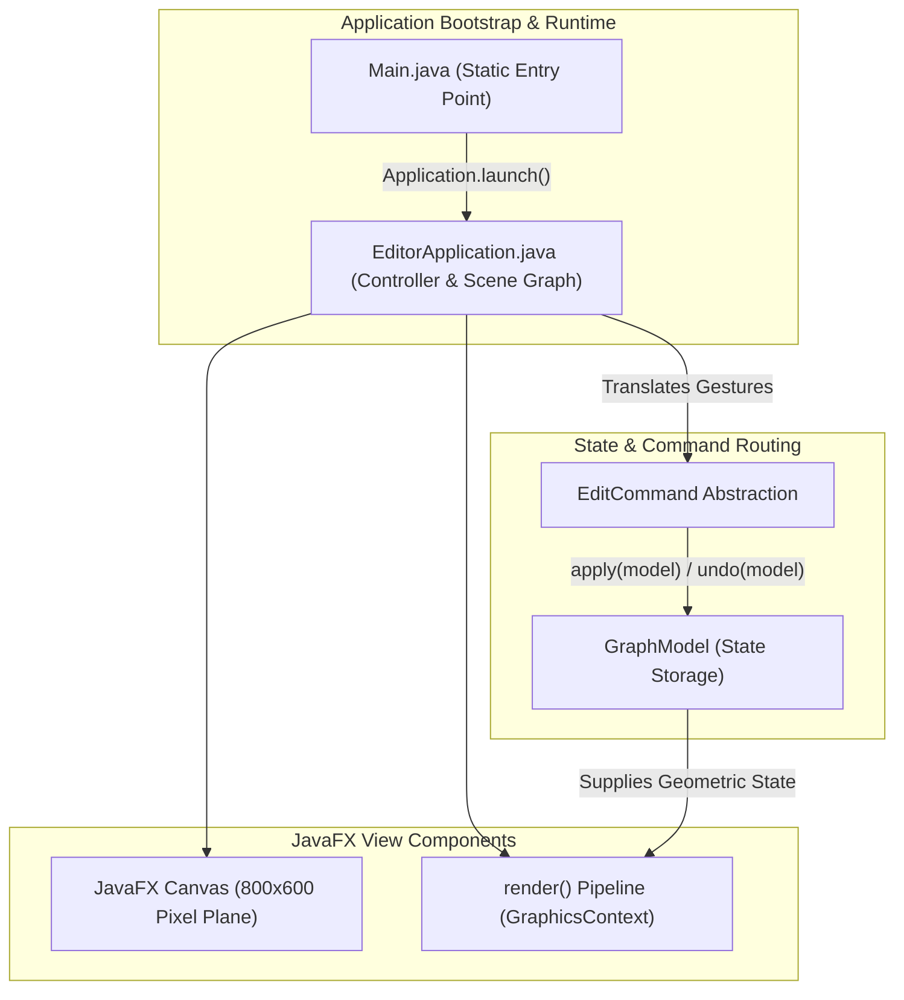
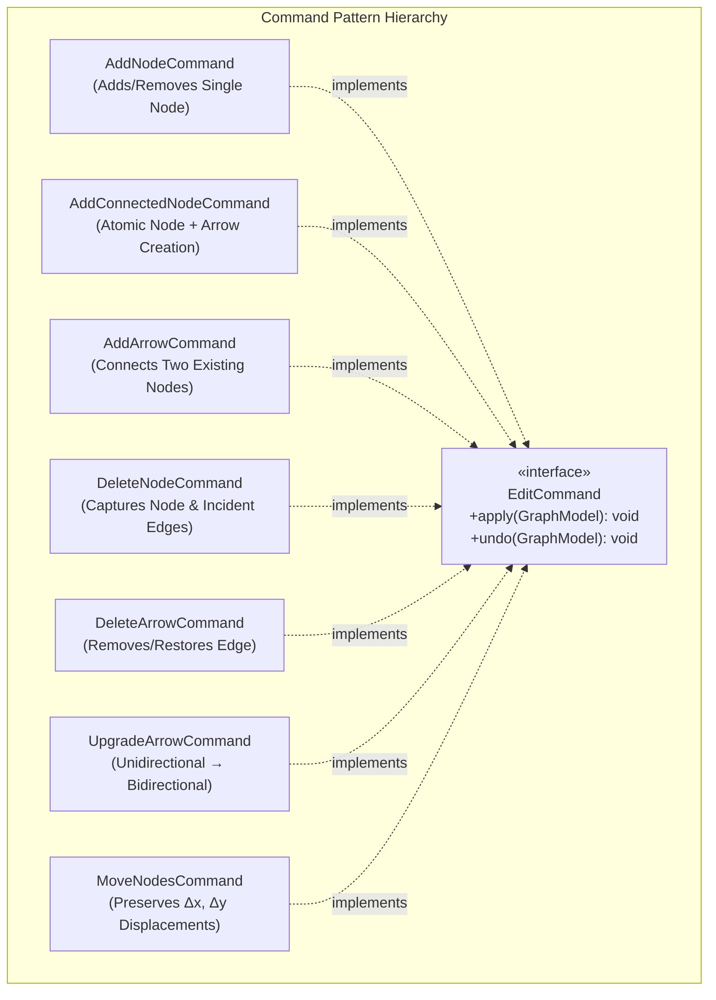
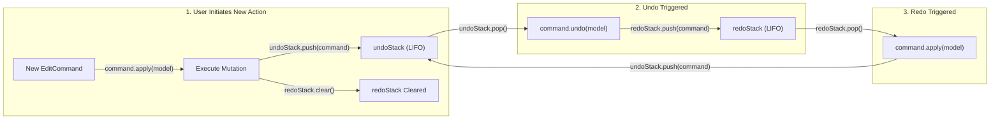

# 📝 Class Notes

### Topic 1: Professor Project Review & Desktop Architecture Evaluation (`EditorApplication` vs `Main` Bootstrap)
During the professor's project review of the CSC360 Group 2 Graph Editor, significant emphasis was placed on architectural modularity, runtime isolation, and clean controller decoupling. Engineered with Java 21, JavaFX 23, Apache Maven, and JUnit 5, the desktop application operates within an 800×600 pixel interactive canvas. A key design highlight evaluated by the professor was the strict separation of bootstrapping in `Main.java` from UI controller logic in `EditorApplication.java`. Launching JavaFX through an external static main wrapper prevents Java Platform Module System (JPMS) classpath conflicts, missing runtime component exceptions, and launcher lifecycle crashes across cross-platform environments.

`EditorApplication.java` functions as the centralized controller and user interaction hub. Rather than coupling mouse listeners directly to domain state modifications, the controller interprets user events—such as secondary button clicks, drag vectors, selection gestures, and modifier keys—and translates them into semantic editing commands. This event-driven separation of concerns ensures that the view layer remains a passive observer whose display is updated deterministically via `render()`, preventing event handler bloat and maintaining thread isolation within the JavaFX Application Thread.

### Topic 2: Graph Domain State & Immutability Patterns (`GraphModel`, `GraphNode`, `GraphArrow`)
The professor critically examined the graph domain model, specifically validating how vertices, edges, and topologies are represented in memory. `GraphModel.java` acts as the persistent storage engine, holding all `GraphNode` and `GraphArrow` instances inside `LinkedHashMap<Integer, GraphNode>` and `LinkedHashMap<Integer, GraphArrow>` collections. Utilizing `LinkedHashMap` provides dual advantages: it delivers guaranteed $O(1)$ average-time complexity for lookups, insertions, and removals by unique integer IDs, while preserving deterministic insertion-order iteration during canvas rendering loops and JSON serialization routines.

A central software engineering triumph noted in the review is the immutable design of `GraphNode` and `GraphArrow`. Instead of exposing mutable coordinate fields (`x`, `y`) or mutable bidirectional boolean flags through public setters, `GraphNode` employs functional copy mutators such as `withPosition(double newX, double newY)`. Immutability eliminates unintended aliasing bugs, side effects across rendering cycles, and concurrent state corruption when nodes are referenced across the undo/redo history stacks. When directed arrows are converted to bidirectional links, `GraphArrow` similarly returns a revised instance with updated directional flags, guaranteeing snapshot integrity across the application lifecycle.

### Topic 3: Command Design Pattern & Reversible Execution Mechanics (`EditCommand` Hierarchy)
The structural cornerstone of the Graph Editor is the Command Design Pattern, which establishes an indirection layer between user input triggers and domain model mutations. The `EditCommand` interface enforces two fundamental polymorphic contracts: `apply(GraphModel model)` to perform a forward state transition, and `undo(GraphModel model)` to reverse that transition. By reifying editing actions into first-class command objects, the application eliminates hardcoded procedural mutation logic from UI event handlers and provides a scalable framework where future editing capabilities (such as node restyling) can be integrated without modifying existing history engines.

The command hierarchy addresses both primitive operations and complex topological dependencies. Atomic commands include `AddNodeCommand`, `AddArrowCommand`, `DeleteArrowCommand`, and `UpgradeArrowCommand` (which transitions a unidirectional edge $A \to B$ into a bidirectional edge $A \leftrightarrow B$). Compound commands preserve structural relationships: `AddConnectedNodeCommand` atomically creates a new node alongside an incident arrow originating from an active parent, rolling both back simultaneously on undo. Crucially, `DeleteNodeCommand` solves relational dependencies: prior to removing a node from `GraphModel`, it captures a snapshot of the vertex and all connected incident arrows; upon `undo()`, it restores the vertex and re-establishes all incident edges, completely preventing orphan edges and topological corruption. Similarly, `MoveNodesCommand` records coordinate displacement deltas ($\Delta x$, $\Delta y$) across multi-node selections, restoring precise spatial geometry on rollback.

### Topic 4: History Management via Custom `LinkedStack<T>` & Non-Linear History Invalidation
The review praised the application's deliberate avoidance of Java's legacy `java.util.Stack`. Java's built-in stack inherits from `java.util.Vector`, imposing unnecessary synchronization overhead on single-threaded GUI threads and violating fundamental stack encapsulation by permitting index-based arbitrary access. Instead, the project implements a custom generic `LinkedStack<T>` using an internal singly linked list. Each stack element encapsulates a data payload alongside a reference to its successor, guaranteeing strictly bounded $O(1)$ time complexity for `push()`, `pop()`, and `peek()` operations with zero array resizing or array copying overhead.

The undo/redo engine coordinates two distinct instances of `LinkedStack<EditCommand>`: `undoStack` and `redoStack`. When a user performs an editing action, `command.apply(model)` executes, the command is pushed onto `undoStack`, and `redoStack.clear()` is called. Pressing Undo pops the latest command from `undoStack`, executes `command.undo(model)`, and pushes it onto `redoStack`. Pressing Redo pops from `redoStack`, invokes `command.apply(model)`, and pushes it back onto `undoStack`. The professor highlighted the theoretical necessity of clearing `redoStack` upon any new user action: executing a new mutation while in an un-done state establishes a divergent, branching history timeline. Because linear stacks cannot track non-linear branches, clearing the redo history prevents invalid future states and guarantees a strictly deterministic editing sequence.

### Topic 5: Mouse Interaction Disambiguation & Contextual Gesture Routing (Click vs Drag)
A major focal point of the professor's review was the precision of user interaction disambiguation on the dynamic canvas. Interactive graphic editors face inherent ambiguity when mapping multiple gestures (selection, creation, connection, movement, deletion) to common mouse inputs. `EditorApplication` resolves this by recording the initial coordinates (`pressX`, `pressY`) on `MOUSE_PRESSED` and computing the Euclidean displacement distance upon `MOUSE_RELEASED`. Displacements falling within an empirical threshold ($\le 5\text{ pixels}$) are classified as stationary clicks, whereas displacements exceeding 5 pixels are classified as drag operations. This threshold filters out accidental micro-movements of the physical mouse during quick clicks.

Contextual mouse routing enables an intuitive editing workflow without relying on complex mode bars. A stationary right-click on empty canvas space dispatches an `AddNodeCommand`. If an existing node is currently selected, right-clicking on empty canvas triggers `AddConnectedNodeCommand`, creating a new node and an incoming directed edge in a single gesture. Left-clicking an existing node and dragging to a target node dispatches `AddArrowCommand`; if a directed arrow already exists in the reverse direction ($B \to A$), dragging from $A$ back to $B$ dispatches `UpgradeArrowCommand`, upgrading the connection to a bidirectional link. Left-clicking and dragging an unselected node executes node movement, while holding the `Shift` modifier key allows multi-node selection, enabling compound translation via `MoveNodesCommand`. Finally, a stationary left-click directly on an entity initiates immediate deletion.

### Topic 6: Computational Boundary Clipping & Orthogonal Segment Hit Detection (`GeometryUtils`)
Visual aesthetics and mathematical precision are decoupled from the controller into `GeometryUtils.java`. If connector lines were drawn directly from source node center $(x_1, y_1)$ to target center $(x_2, y_2)$, the shafts and arrowheads would penetrate into circular node interiors, creating unacceptable visual artifacts. `GeometryUtils` prevents this by computing the connecting angle via $\theta = \text{atan2}(y_2 - y_1, x_2 - x_1)$. The arrow shaft is clipped to the outer perimeters by shifting the start coordinate forward by node radius $R$ ($x_{\text{start}} = x_1 + R\cos\theta, y_{\text{start}} = y_1 + R\sin\theta$) and shifting the end coordinate backward by $R$ ($x_{\text{end}} = x_2 - R\cos\theta, y_{\text{end}} = y_2 - R\sin\theta$). This trigonometric clipping ensures arrowheads dock flush against circular boundaries.

For edge selection and deletion, hit detection on narrow 1-to-2-pixel arrow shafts is notoriously error-prone for users. `GeometryUtils` implements orthogonal point-to-segment distance calculation via `pointToSegmentDistance(px, py, x1, y1, x2, y2)`. By projecting the cursor coordinate vector onto the line segment vector using dot-product scalar projection clamped between $[0, 1]$, the algorithm identifies the closest Euclidean distance from the click point to the line segment. If this orthogonal distance is within an empirical 6-pixel tolerance buffer, a positive edge hit is registered, enabling smooth and forgiving user selection.

```mermaid
flowchart TD
    subgraph TrigonometricClipping ["Perimeter Boundary Docking via atan2"]
        C1["Node 1 Center (x1, y1)"] -->|"Vector Shift: +R*cos(θ), +R*sin(θ)"| S["Arrow Start (Perimeter)"]
        S -->|"Clipped Line Segment"| E["Arrow End (Perimeter)"]
        E -->|"Vector Shift: -R*cos(θ), -R*sin(θ)"| C2["Node 2 Center (x2, y2)"]
    end
    subgraph OrthogonalProjection ["Point-to-Segment Hit Detection"]
        M["Mouse Click (px, py)"] -->|"Scalar Dot-Product Projection"| PROJ["Perpendicular Closest Point"]
        PROJ -->|"Distance <= 6px Tolerance"| HIT["Positive Edge Hit Registered"]
    end
```

### Topic 7: Model Invariance vs Transient UI Feedback (`PullMotionModel`) & Monotonic JSON Serialization (`GraphJsonCodec`)
The professor highlighted the critical software engineering distinction between transient UI kinematics and persistent model invariance. `PullMotionModel.java` generates responsive physics-inspired visual feedback when a user drags an arrow connection near candidate target nodes. As the mouse cursor enters proximity, candidate nodes visually stretch and displace toward the cursor using non-linear easing functions. However, this deformation exists strictly in the view layer during `render()` through `GraphicsContext` coordinate transformations. The true coordinates within `GraphModel` remain strictly invariant throughout the gesture. Maintaining model invariance prevents accumulated floating-point rounding errors, protects graph topology, and ensures animation frames do not pollute the undo/redo history.

For graph persistence, `GraphJsonCodec.java` provides custom JSON serialization and deserialization without external libraries like Jackson or Gson. Omitting third-party dependencies eliminates supply-chain security risks, keeps build artifacts lightweight, and fulfills strict academic constraints. A vital technical challenge in graph deserialization is entity identifier continuity. If an imported graph contains existing IDs (e.g., vertices 1, 2, 3, and 8), initializing new entities with a naïve counter starting at 1 would cause immediate primary key collisions within `LinkedHashMap`. `GraphJsonCodec` inspects the maximum identifier across all imported nodes and arrows ($\text{maxId} = \max(\text{allIds})$) and re-anchors the model's next identifier sequence to $\text{nextId} = \text{maxId} + 1$, guaranteeing monotonic ID uniqueness.

### Topic 8: Automated Regression Testing with JUnit 5 & Viva Defense Preparation
The professor concluded the review by evaluating the automated verification suite and viva defense preparedness. The Graph Editor is accompanied by approximately 27 automated unit test cases built with JUnit 5. The testing strategy focuses on structural invariants and operational reversibility: every concrete command is tested against the reversibility invariant $\text{model} \equiv \text{undo}(\text{apply}(\text{model}))$, proving that command execution followed by rollback guarantees exact bitwise state restoration. Additional tests validate geometric clipping accuracy in `GeometryUtils`, verify $O(1)$ LIFO contracts in `LinkedStack<T>`, and validate round-trip JSON serialization fidelity.

For oral viva defense and engineering presentations, the architectural takeaways form a compelling defense narrative. Key viva discussion points include justifying the Command Pattern for decoupled undo/redo, contrasting custom `LinkedStack` with legacy `java.util.Stack`, defending the mathematical necessity of clearing `redoStack` to prevent invalid branched timelines, explaining trigonometric radius offset in `atan2`, and articulating why model invariance in `PullMotionModel` is vital for data integrity. Build and execution targets are orchestrated cleanly through the Maven Wrapper (`.\mvnw.cmd javafx:run` and `.\mvnw.cmd test`), ensuring reproducible, platform-independent execution.

# 💡 Class Reflection — 01/10/26
- **Topics Covered**: Professor Project Review & Desktop Architecture Evaluation, Graph Domain State & Immutability Patterns, Command Design Pattern & Reversible Execution Mechanics, History Management via Custom LinkedStack & History Invalidation, Mouse Interaction Disambiguation & Contextual Routing, Computational Boundary Clipping & Segment Hit Detection, Model Invariance vs Transient UI Feedback & Monotonic JSON Serialization, Automated Regression Testing & Viva Defense Preparation.
- **Reflections**:
  - Decoupling `Main.java` bootstrapping from `EditorApplication.java` prevents modern JavaFX module-path collisions and establishes a clean MVC separation.
  - Designing `GraphNode` and `GraphArrow` as immutable value representations inside `LinkedHashMap` guarantees deterministic iteration and eliminates aliasing bugs across history stacks.
  - Reifying user editing gestures into an `EditCommand` hierarchy establishes uniform forward (`apply`) and backward (`undo`) semantics essential for clean graph state restoration.
  - Implementing a custom singly linked `LinkedStack<T>` ensures $O(1)$ LIFO efficiency, while clearing `redoStack` upon new actions prevents divergent, invalid history branches.
  - Computing Euclidean displacement against a 5-pixel threshold cleanly separates stationary clicks from dragging gestures, enabling rich multi-action mouse routing without mode bars.
  - Offsetting connector endpoints by node radii using $\text{atan2}$ and implementing orthogonal point-to-segment distance projections delivers clean visual boundaries and intuitive hit detection.
  - Confining pull animations to transient rendering kinematics preserves underlying `GraphModel` coordinate invariance, while re-anchoring sequences to $\text{maxId} + 1$ prevents ID collisions on file import.
  - Automated JUnit 5 reversibility testing ($\text{undo}(\text{apply}) = I$) provides mathematical verification of graph state integrity and establishes a rigorous viva defense foundation.
