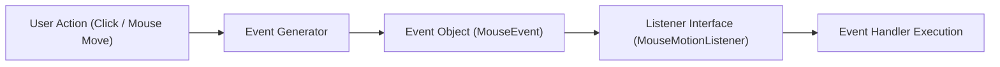

# Class Questions & Answers — August 6, 2026

**Date:** 06/08/2026  
**Course:** CSC360 — Computer Graphics  
**Subject:** Fundamental Concepts & GitHub Integration

---

### Q1. How is computer graphics different from image processing?

| Feature | Computer Graphics | Image Processing |
| :--- | :--- | :--- |
| **Primary Goal** | **Synthesizes / creates** new visual images or 3D models using mathematical algorithms. | **Analyzes / enhances** pre-existing images. |
| **Input Data** | Mathematical descriptions, geometry specifications, lighting parameters. | Raw pixel arrays / raster images. |
| **Output Data** | Synthesized raster or vector images. | Enhanced raster image, extracted features, or metrics. |
| **Example** | Creating a 3D video game character or vector logo. | Removing photographic noise or applying image sharpen filters. |

---

### Q2. What are the geometry primitives of drawing?

Geometric primitives are the fundamental building blocks used to construct complex 2D and 3D computer graphics objects:

1. **Point**: A specific 0D coordinate location $(x, y)$.
2. **Line**: A 1D path connecting two endpoint vertices.
3. **Circle / Ellipse**: 2D curved geometric primitives defined by center coordinate and radii.
4. **Rectangle / Square**: 2D polygons formed by four orthogonal line segments.
5. **Triangle**: A 3-sided polygon, the core primitive used in polygon mesh rendering.
6. **Polygon**: Multi-sided closed shapes composed of connected line segments.
7. **Curve**: Parametric continuous paths (e.g., Bézier curves, B-splines).

---

### Q3. Describe graphical framework in Java.

Java provides three primary graphical user interface (GUI) and graphics rendering frameworks:

#### 1. AWT (Abstract Window Toolkit — `java.awt`)
* The original Java GUI toolkit.
* Uses native OS windowing components ("heavyweight" peers).
* Provides fundamental 2D graphics primitives (`Graphics`, `Graphics2D`, `Color`, `Font`, `Shape`).

#### 2. Swing (`javax.swing`)
* Built on top of AWT.
* Provides 100% pure Java components ("lightweight" widgets) painted onto canvas surfaces (`JPanel`, `JFrame`).
* Supports pluggable Look-and-Feel and double-buffering.

#### 3. JavaFX
* A modern GUI platform designed to replace Swing.
* Supports hardware-accelerated 2D/3D graphics, FXML UI layout, and CSS styling.

#### Java Runtime (JRE)
Provides the underlying execution environment, JVM threads (EDT), and core libraries required for running Java GUI applications.

---

### Q4. What is the design pattern for creating user interfaces in Java?

Java uses the **Event-Listener Model** (Delegation Event Model):

1. **User Action**: The user performs an interaction (e.g., mouse move, button click).
2. **Event Dispatch**: Operating system / Swing generates an event object (e.g., `MouseEvent`).
3. **Event Listener**: A registered listener method catches the event.
4. **Handler Execution**: The application code executes the corresponding callback logic (e.g., `mouseMoved()`).

---

### Q5. How is static graphics different from interactive graphics?

* **Static Graphics**: Rendered once and remain unchanged on display without user interaction (e.g., a fixed logo, rendered diagram, or photo).
* **Interactive Graphics**: Dynamically respond to real-time user input via mouse, keyboard, or sensors (e.g., games, interactive simulations, mouse-tracking applications like `MovingTriangle`).

---

### Q6. How is a curve connected to calculus?

Curves are closely linked to calculus because curves represent continuous mathematical functions $y = f(x)$ or parametric functions $(x(t), y(t))$:
* **Derivatives**: Used to compute tangents, slopes, normal vectors, velocity vectors, and curve continuity ($C^0, C^1, C^2$).
* **Integrals**: Used to calculate arc lengths, enclosed surface areas, and volumes of revolution.
* **Parametric Curves**: Bézier curves and splines rely on calculus-based polynomial interpolation to achieve smooth rendering in animation and computer graphics.

---

### Q7. Describe SSH and HTTPS for accessing a GitHub repository.

#### SSH (Secure Shell)
* Secure connection utilizing **asymmetric key pairs**.
* Authenticates automatically via key matching without requiring passwords during git commands.
* Commonly used by software developers for automated workflows.

#### HTTPS (Hypertext Transfer Protocol Secure)
* Connects over web-based secure protocols.
* Authenticates using a **GitHub Personal Access Token (PAT)** or Git Credential Manager.
* Simple to set up without local key generation.

---

### Q8. Mention tools used for SSH.

* **`ssh-keygen`**: Command-line tool used to generate public and private cryptographic key pairs (e.g., RSA or Ed25519).
* **`ssh`**: Client program used to test authentication (`ssh -T git@github.com`).
* **SSH Agent (`ssh-agent`)**: Background daemon holding private keys in memory for single sign-on authentication.

---

### Q9. What are public and private keys?

When `ssh-keygen` generates a key pair:

* **Public Key** (stored in `.pub` file, e.g., `id_ed25519.pub`): Shared publicly with remote servers like GitHub. Used to encrypt data or verify signatures.
* **Private Key** (stored without extension, e.g., `id_ed25519`): Stored strictly on the local machine and kept secret. Used to decrypt messages and prove identity.
* **Working Principle**: Data encrypted with the public key can only be decrypted by the matching private key.
