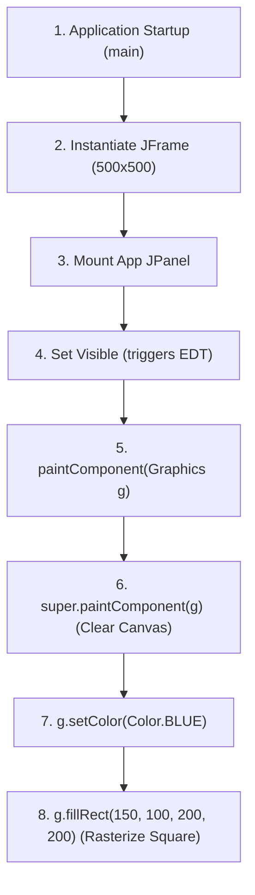

# Class Reflection — August 18, 2026

**Date:** 18/08/2026  
**Course:** CSC360 — Computer Graphics  
**Topics Covered:** Detailed Rendering Algorithm, Java GUI Framework Breakdown, Maven Project Layout

---

## 1. Java GUI & Graphics Framework Breakdown

### AWT (Abstract Window Toolkit — `java.awt`)
* **Type**: Heavyweight components (delegates rendering to OS native peers).
* **Role**: Provides fundamental graphics classes (`Graphics`, `Color`, `Font`, `Shape`, `AffineTransform`).

### Swing (`javax.swing`)
* **Type**: Lightweight components (painted directly in Java without native peer windows).
* **Role**: Provides standard UI widgets (`JPanel`, `JFrame`, `JButton`) and customizable Look-and-Feel with double buffering.

### JavaFX
* **Type**: Modern client platform.
* **Role**: Hardware-accelerated graphics engine supporting 2D/3D scenes, CSS layout styling, and FXML.

---

## 2. Detailed Rendering Algorithm for Maven Square (`App.java`)



### Execution Steps
1. **Application Initialization**:
   - `main()` instantiates a `JFrame` titled `"My Maven Square Project"`.
   - Sets window size to `500 x 500` pixels and configures `setDefaultCloseOperation(JFrame.EXIT_ON_CLOSE)`.
2. **Component Mounting**:
   - Instantiates `App` (extending `JPanel`) and attaches it to the frame container.
   - Calls `frame.setVisible(true)` to trigger the Swing Event Dispatch Thread (EDT).
3. **Graphics Context Preparation**:
   - The EDT invokes `paintComponent(Graphics g)`.
   - Executes `super.paintComponent(g)` to wipe previous frame pixels and prepare the double-buffered graphics context.
4. **Color & Rasterization**:
   - Invokes `g.setColor(Color.BLUE)` to set current brush state to Blue.
   - Executes `g.fillRect(150, 100, 200, 200)`:
     * Positions top-left origin at coordinate `(x=150, y=100)`.
     * Fills a rectangular matrix spanning `200px` width by `200px` height.

---

## 3. Standard Maven Folder Architecture (`maven-square`)

```text
maven-square/
├── pom.xml                                   # Project Object Model (dependencies & compiler specs)
└── src/
    ├── main/
    │   └── java/
    │       └── com/
    │           └── example/
    │               └── App.java              # Main Java Swing graphics application
    └── test/
        └── java/
            └── com/
                └── example/
                    └── AppTest.java          # JUnit test cases
```

### Folder Responsibilities
* **`pom.xml`**: Central configuration file defining group artifact ID, build lifecycle, and dependencies.
* **`src/main/java/`**: Source root for application Java code organized by package namespace (`com.example`).
* **`src/test/java/`**: Test root containing unit test classes (`AppTest.java`).
* **`target/`**: Automatically generated build output directory storing compiled `.class` files and output JARs.
